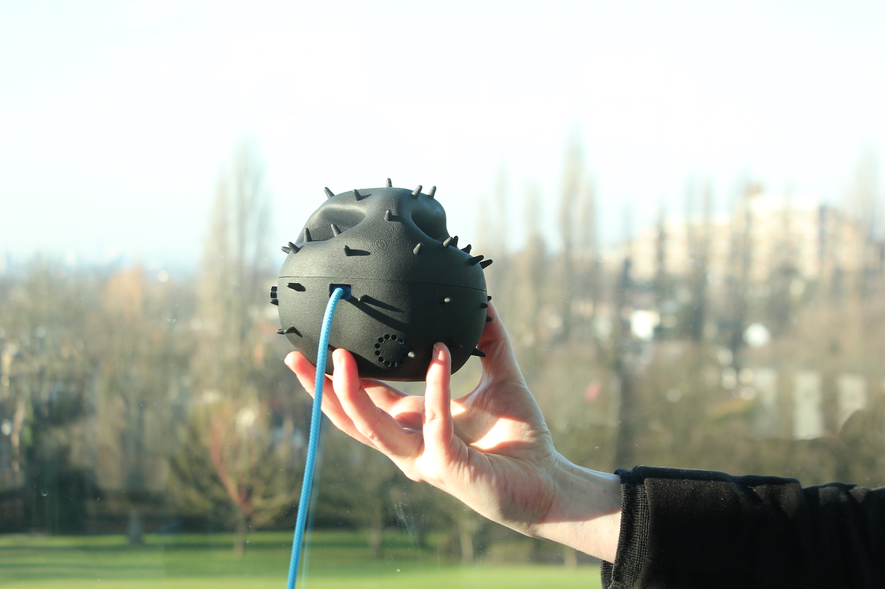

# AirKit Logbook

The AirKit Logbook has been developed as a resource for learning more about air quality and air pollution. It is part of the AirKit toolkit for citizen-led air quality monitoring. Within the logbook there are resources to help you [set up an air quality project](https://github.com/citizensense/AirKit_Logbook/blob/master/toolkit.md#2-air-quality-monitoring) or campaign to improve air quality. The Logbook also contains instructions for [building](https://github.com/citizensense/AirKit_Logbook/blob/master/toolkit.md#3-building-a-dustbox-20), [setting up, calibrating and using](https://github.com/citizensense/AirKit_Logbook/blob/master/toolkit.md#4-setting-up-your-dustbox-in-the-field) an air quality sensor for monitoring particulate matter, the Dustbox 2.0. There are resources for [analyzing your data](https://github.com/citizensense/AirKit_Logbook/blob/master/toolkit.md#5-data-analysis-and-data-stories) on our data analysis platform, [Airsift](https://airsift.citizensense.net/), which allows you to map and record observations and to generate data stories with citizen data. The AirKit Logbook has three Appendices that include an [FAQ and troubleshooting](https://github.com/citizensense/AirKit_Logbook/blob/master/toolkit.md#appendix-1-troubleshooting-and-faq) section to answer common questions relating to different elements of AirKit, instructions for [building your own Stevenson screen](https://github.com/citizensense/AirKit_Logbook/blob/master/toolkit.md#appendix-2-building-a-stevenson-screen) as a weatherproof Dustbox 2.0 shelter, and additional [resources on air quality](https://github.com/citizensense/AirKit_Logbook/blob/master/toolkit.md#appendix-3-additional-resources).

This Github page also contains links to software and hardware related to the Dustbox 2.0. This includes Gerber files for printing the [Dustbox 2.0 PCB](https://github.com/citizensense/AirKit_Logbook/tree/main/dustbox_2_0_PCB/GerberFiles), [source code](https://github.com/citizensense/AirKit_Logbook/blob/main/dustbox_2.0_source_code_v13.zip) and [enclosure STL files][**Update this Link**] for 3D printing.

  Installing a Dustbox at the Horniman Museum and Gardens

AirKit is developed through the [Citizen Sense](https://citizensense.net) project, which is led by Prof Jennifer Gabrys as part of the [Planetary Praxis](https://planetarypraxis.org/) research group in the Department of Sociology at the University of Cambridge. This research has received funding from the European Research Council (ERC) to support [Citizen Sense](https://citizensense.net) through an ERC Starting Grant [313347](https://cordis.europa.eu/project/id/313347), and to support AirKit through an ERC Proof of Concept Grant [779921](https://cordis.europa.eu/project/id/779921). We welcome your comments and feedback to improve the toolkit. If you would like to get in touch, you can contact us at [info@citizensense.net](mailto:info@citizensense.net). AirKit is available to use under a [CC BY-NC-SA](https://creativecommons.org/licenses/by-nc-sa/4.0/) license. You are free to use, adapt, and share this toolkit for non-commercial purposes under the same CC BY-NC-SA license, and with attribution to Citizen Sense. 
 
