# AirKit

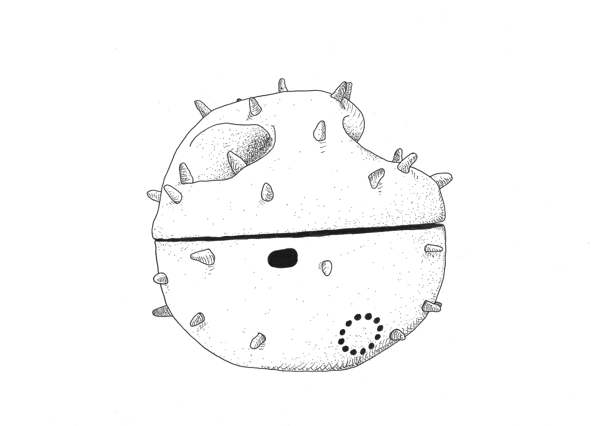 

## Table of Contents
1. [AirKit Introduction](https://github.com/citizensense/Airkit/blob/master/toolkit.md#1-airkit-introduction)
2. [Air Quality Monitoring](https://github.com/citizensense/Airkit/blob/master/toolkit.md#2-air-quality-monitoring)
3. [Building a Dustbox 2.0](https://github.com/citizensense/Airkit/blob/master/toolkit.md#3-building-a-dustbox-20)
4. [Setting up Your Dustbox in the Field](https://github.com/citizensense/Airkit/blob/master/toolkit.md#4-setting-up-your-dustbox-in-the-field)
5. [Data Analysis and Data Stories](https://github.com/citizensense/Airkit/blob/master/toolkit.md#5-data-analysis-and-data-stories)
6. [Summary and Acknowledgments](https://github.com/citizensense/Airkit/blob/master/toolkit.md#6-summary-and-acknowledgments)
7. [Appendix 1](https://github.com/citizensense/Airkit/blob/master/toolkit.md#appendix-1-troubleshooting-and-faq): Troubleshooting and FAQs
8. [Appendix 2](https://github.com/citizensense/Airkit/blob/master/toolkit.md#appendix-2-building-a-stevenson-screen): Building a Stevenson Screen
9. [Appendix 3](https://github.com/citizensense/Airkit/blob/master/toolkit.md#appendix-3-additional-resources): Additional Resources 

## 1. AirKit Introduction

[AirKit](https://citizensense.net/projects/airkit/) is an air quality monitoring toolkit that can be used by a broad range of community groups, concerned citizens and environmental initiatives in order to observe, document and address the problem of air pollution. 

Air pollution is a planetary health emergency. Nearly 9 million people worldwide die from air pollution every year. Many people also suffer from ongoing health problems due to air pollution, including asthma, cardiac and pulmonary problems, and even neurological impairment. Air quality monitors are not always located where air pollution is occurring, and citizens might have many reasons to gather data to document and analyze air quality. AirKit brings together information for you to set up a citizen-led monitoring project to keep track of air quality in your area. 

This AirKit Logbook includes resources for learning more about air quality and air pollution, including strategies for setting up air quality monitoring projects and campaigns to improve air quality. The Logbook also contains instructions for building, setting up, calibrating and using an air quality sensor for monitoring particulate matter, the Dustbox 2.0. There are resources for analyzing your data on our data analysis platform, [Airsift](https://airsift.citizensense.net/), which allows you to map and record observations and to generate data stories with citizen data. The AirKit Logbook has three Appendices that include an FAQ and troubleshooting section to answer common questions relating to different elements of AirKit, instructions for building your own Stevenson screen as a weatherproof Dustbox 2.0 shelter, and additional resources on air quality.

AirKit is developed through the [Citizen Sense](https://citizensense.net) project, which is led by Prof Jennifer Gabrys as part of the [Planetary Praxis](https://planetarypraxis.org/) research group in the Department of Sociology at the University of Cambridge. This research has received funding from the European Research Council (ERC) to support [Citizen Sense](https://citizensense.net) through an ERC Starting Grant [313347](https://cordis.europa.eu/project/id/313347), and to support AirKit through an ERC Proof of Concept Grant [779921](https://cordis.europa.eu/project/id/779921). We welcome your comments and feedback to improve the toolkit. If you would like to get in touch, you can contact us at [info@citizensense.net](mailto:info@citizensense.net). AirKit is available to use under a [CC BY-NC-SA](https://creativecommons.org/licenses/by-nc-sa/4.0/) license. You are free to use, adapt, and share this toolkit for non-commercial purposes under the same CC BY-NC-SA license, and with attribution to Citizen Sense. 
 

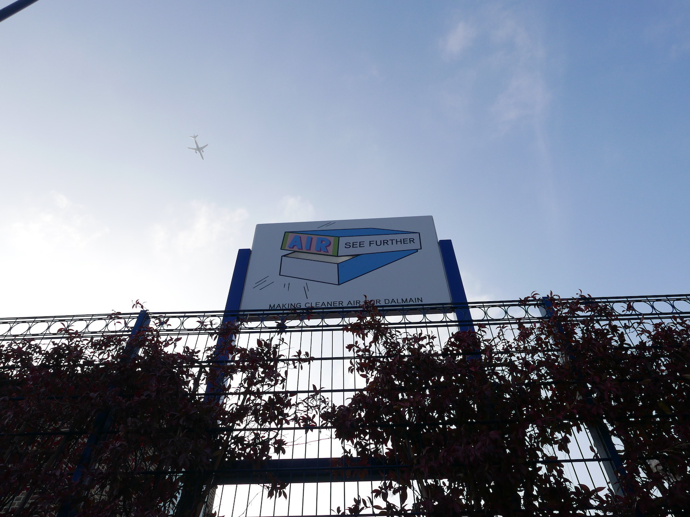 A plane flies above the green screen at Dalmain Primary School

## 2. Air Quality Monitoring

The prevalence of air quality monitoring has increased rapidly in the past decade in response to increasing concerns around the health effects of pollution. Air quality monitoring networks usually have a regulatory function and are typically managed by government agencies, sometimes in collaboration with academic institutions and scientists. Large and expensive equipment typically forms the sensing infrastructure of these networks, which provide highly accurate measurements of pollution levels. However, the cost and size of these instruments has a significant impact on the density of networks and leaves many areas sparsely monitored, or not monitored at all. 

At the same time, there has been a marked increase in the availability and accuracy of low-cost monitors. As a result, citizen monitoring activities are now much more common, and many people are setting up sensors in their local areas. Pollution is experienced at both local and regional levels. Localised and denser networks of monitors can show differences across local and regional pollution levels, while helping to identify possible pollution sources in specific areas. 

While sensor devices offer new opportunities for citizens to monitor air quality, community engagement is key to setting up air quality monitoring networks. Citizen contributions to monitoring networks include local expertise and observations, existing and emerging community organisations, as well as infrastructural resources such as power, a network connection and space to install monitors. This section outlines in more detail the extent to which air pollution is a planetary health concern and why monitoring air quality is important. It then offers some strategies for developing your own air quality study. 

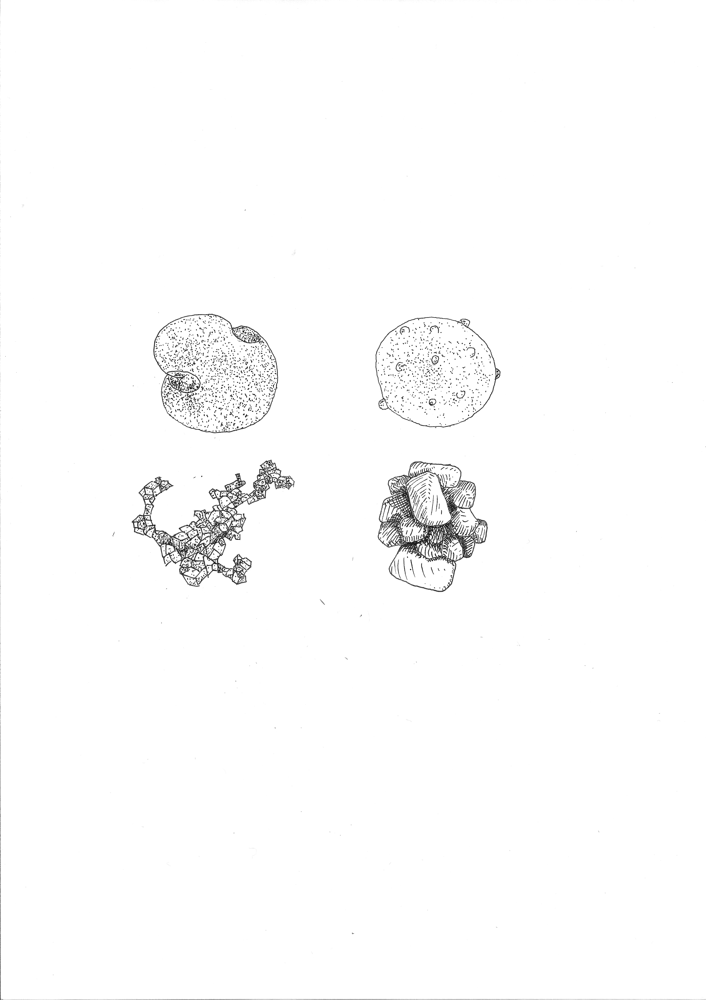 Particles that comprise particulate matter

### 2.1. The problem of air quality worldwide 

Air pollution is a planetary health hazard. With continuous industrialisation and urbanisation, it has emerged as one of the most important risk factors affecting human health and sustainable development. Air pollution is a leading risk factor for non-communicable diseases and accounts for 22% of all deaths from cardiovascular related disease, 26% of deaths related to ischaemic heart disease, 25% of deaths related to stroke, 53% of deaths related to chronic obstructive pulmonary disease and 40% of deaths related to lung cancer ([Reddy, K.S. and Roberts, J.H., 2019](https://www.thelancet.com/journals/lanplh/article/PIIS2542-5196(18)30286-9/fulltext)).

In addition to polluting environments, air pollution can also have indirect health effects and contribute to climate change. Increases in the greenhouse gases can lead to extreme weather conditions, including heat waves and smog events, which can have further negative impacts on human health. 

### 2.2. Why monitor your air quality?

Air pollution can be broadly classified into suspended particles and gases. Suspended particles are collectively known as particulate matter (PM). Particulate matter is a significantly hazardous pollutant, which has deleterious impacts on human health ([Dockery, Douglas W. et al., 1993 ](https://www.nejm.org/doi/full/10.1056/NEJM199312093292401)). PM is dangerous for human health as it is breathed into the lungs and can easily reach deeper into the respiratory system. 

Primary sources of PM include the combustion of fuel and other anthropogenic activities such as agriculture and transport infrastructure are considered to be significant sources of PM. Additional sources of PM include wildfires, desert dust and volcanoes ([Mallone, S. et al., 2011](https://ehp.niehs.nih.gov/doi/full/10.1289/ehp.1003026)). Components of PM include finely divided solids or liquids such as dust, soot, smoke, aerosols, fumes and condensing vapors. Particle pollution in the air comes in a wide range of sizes. The standard measuring unit for these particles is micrograms per cubic meter:

* PM 1: Particles with diameter <1 μm
* PM 2.5: Particles with diameter <2.5 μm  
* PM 10: Particles with diameter <10 μm

Fixed air quality monitoring stations are the primary means to collect air quality data in many parts of the world. Yet their deployment cost and maintenance often results in accurate but geographically sparse monitoring. Citizen air quality monitoring practices provide a way to monitor personal exposure as well as generate fine-grained air quality data at a higher spatio-temporal resolution.

Because PM has a significant effect on health, and existing monitoring networks are not entirely effective in identifying localised pollution sources, we have developed this AirKit resource for communities to set up their own citizen sensing networks.

### 2.3. How to design an air quality project

Maybe you have noticed that at certain times of day the air in your local area looks hazy or smells polluted. You close your windows and avoid going outside at certain times of day. Perhaps you have taken a walk and noticed a new planning application posted near the site of a community greenspace, and wonder how this will affect changes in air quality.

There are many reasons why you may be interested to organise a citizen sensing study. This section includes some guidance on how to organise your community to monitor air quality including: what to look out for, how to plan a study, how to set up monitors, how to collect data and how to analyze data.

First, you might ask what you want to learn about your local air quality. You might want to understand what the ambient levels of pollution are in your area, or to use citizen data to identify a pollution source. You might have noticed visible pollution, development activity or noise. 

Next, you might consider how the air quality problem that you identify can be tackled through monitoring pollution. You could think about how these problems are impacting your community in relation to health effects, ventilation and outdoor activities. You might also consider what other materials and evidence would be useful to gather to document the problem, in addition ot monitoring data.

How you currently understand the problem will inform your approach to monitoring. Below are some example questions that might help you in developing your plan for monitoring and analysis.

Examples of questions:

* How can I measure changes in local air quality?
* What is causing the air pollution problem here?
* Is this area a pollution hotspot?
* What are the air quality trends in my local area? What are possible pollution sources?
* Are there any obvious sources of pollution, such as highly congested roads, major traffic intersections, or industrial activity.
* How are new developments and construction affecting local air quality?
* How is transport infrastructure impacting local air quality?
* Are there are more vehicles on the road?
* Are there plans to change existing transport infrastructure? 
* Has the landscape in the local area changed recently?

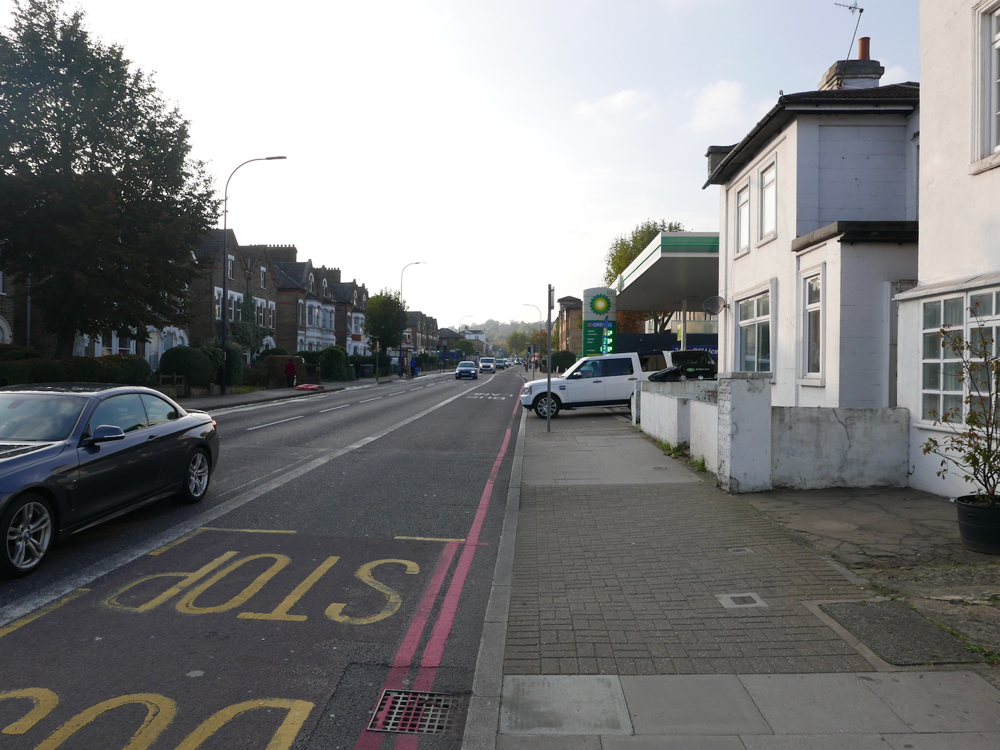 
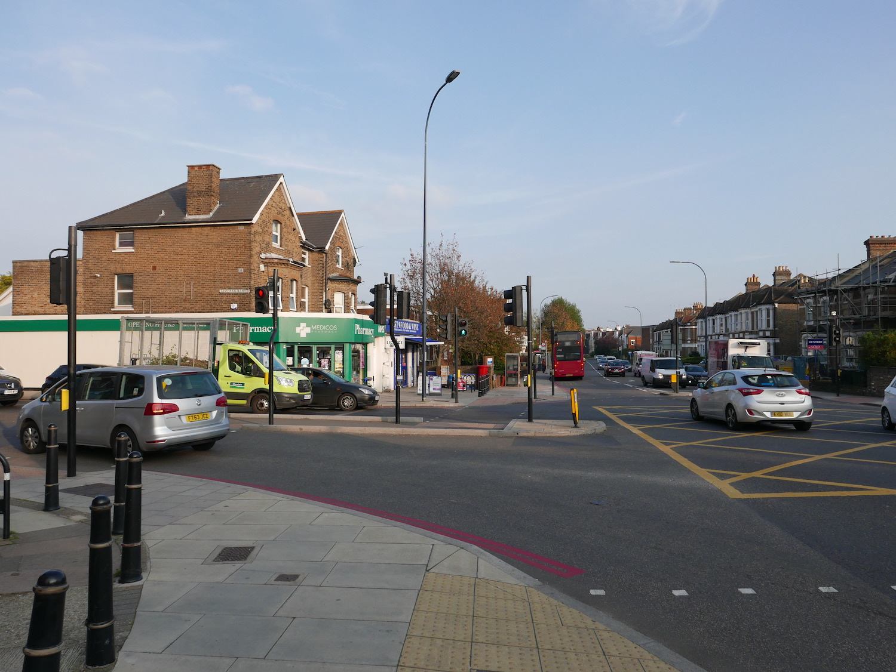 
  Views along the South Circular, London
 

We encourage a collective approach to monitoring because it can create a more detailed view of air quality issues in your area to have multiple data points and observers of local conditions. This approach enables you to develop a denser and strategically-placed network of sensors that can create a richer data set. Citizen data can then be used to evidence and support community concerns about pollution and urban infrastructure. It can also potentially allow you to form a more comprehensive and strategic response to potential sources of pollution in your area. 

The number of people in your group may vary depending on the question that you are asking about local pollution. If you are concerned with the ambient pollution levels in the local area, you could organise a group of people to monitor in their back gardens. If you are looking at a specific pollution source, you may want to set up several devices close to the source, in addition to ambient monitors to gather background readings of air quality.

Your air quality monitoring project might form out of groups of people with a common concern about environmental pollution. You might want to engage with other groups that are campaigning on local issues, citizen scientists and maker groups, local organisations and cultural institutions, schools, business owners and your local council. How many monitoring sites you set up depends on the size and nature of the area you are working in. By having at least 3 sensors in an area, you will be able to compare data between nearby sites and spot trends more easily.

While Dustbox 2.0 and [Airsift](https://airsift.citizensense.net/) provide data on particulate matter, temperature, humidity and wind, you may also want to collect other types of data through making regular observations about noise, smell or other environmental events; mapping; and looking at local development activity. It is important to consider what other kinds of data you can use to tell the story of your local air quality, as well as what data might not capture. You might also notice that there are other monitors in your area, including those maintained by the local council or other citizen devices. You should consider how the placement of your monitors and plans for analyzing data relate to datasets from regulatory monitors. You might find opportunities for funding your monitoring exercise from local government or community organisations.

 
  Traffic in a residential area
 

The next stage is to organise a workshop and walk together around the local area to assess where and how to monitor the outdoor environment.
* A workshop can be a good forum to have people with local expertise present issues, to map where pollution might be occurring, to form a network of monitoring locations, to develop a plan for maintaining the network, and to set objectives for collecting and analyzing data.
* A walk can be an effective way to visit possible monitoring locations, and to allow different members of the group to suggest additional locations.
* When you walk around the area, highlight and note development and construction sites in the area, traffic hotspots, existing monitors, and smart infrastructure that could be collecting different environmental data. 
* Think about how the placement of sensors will allow you to address aspects of your questions.
* You can upload maps, walk itineraries and related materials to the [Airsift](https://airsift.citizensense.net/) platform as observations related to your Dustbox locations and monitoring network. You can also compose these observations into Data Stories that you can share more widely.

A carefully considered plan for setting up your monitoring network can allow you to answer your questions about air quality more effectively, while developing stronger arguments from your findings. It can also ensure that you have adequate resources for your monitoring activity and to anticipate and identify possible problems and issues. We suggest that you document the process of setting up your monitoring network through photographs, video and shared notes, which you can also add to the [Airsift](https://airsift.citizensense.net/) platform. This material will provide a key resource for analyzing and narrating your air quality data.  
   
Additional air quality resources that could help you set up your citizen sensing study are included in [Appendix 3](https://github.com/citizensense/Airkit/blob/master/toolkit.md#appendix-3-additional-resources). 

### 2.4. How to analyze and communicate air quality data

Analyzing your data is a key part of an air quality study. This allows you to interpret and communicate the findings from your data. Common methods for analyzing air pollution data include using visualizations such as time-series graphs to analyse pollutant concentrations over different time periods (hourly, daily, monthly, seasonal); polar plots of PM concentrations with wind direction and wind speed to identify emissions sources and understand patterns; and scatter plots of PM concentration and temperature and humidity to see how weather conditions are impacting your local air quality.

 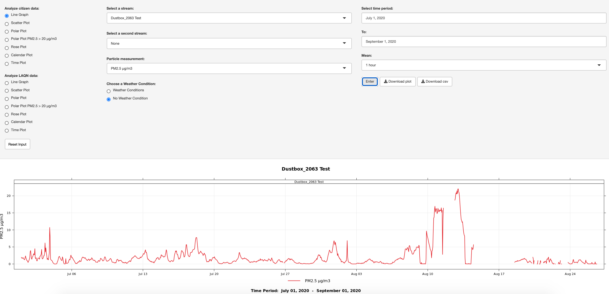
  Screenshot of the Airsift platform

While working with low-cost and DIY sensors, it is important to make sure that the data that is collected is of highest quality and can be used for the intended purpose. For this, Quality Assurance (QA) and Quality Control (QC) activities are recommended to harmonise air quality data ([Piedrahita, Ricardo, et al., 2014](https://amt.copernicus.org/articles/7/3325/2014/)). QA can be considered as an integrated management system to ensure that the device setup and the data quality meet the defined standards with a high level of confidence. QC activities include activities like device [calibration](https://github.com/citizensense/Airkit/blob/master/toolkit.md#41-calibrating-your-dustbox-20). QC can be done in the field as well as through laboratory co-location of sensors with industry grade instruments. Such activities are important to limit the errors in the measurements. 

When documenting your sensor setup, it is important to describe your approach to data collection, measurements and interpretation methods so that the process is clear to others who review your data. There is more information about how to ensure the quality of your data by co-locating and calibrating your sensors available below in [Section 3](https://github.com/citizensense/Airkit/blob/master/toolkit.md#3-building-a-dustbox-20), and on page [XXX] [**add**] of the print and PDF version of this AirKit logbook.

 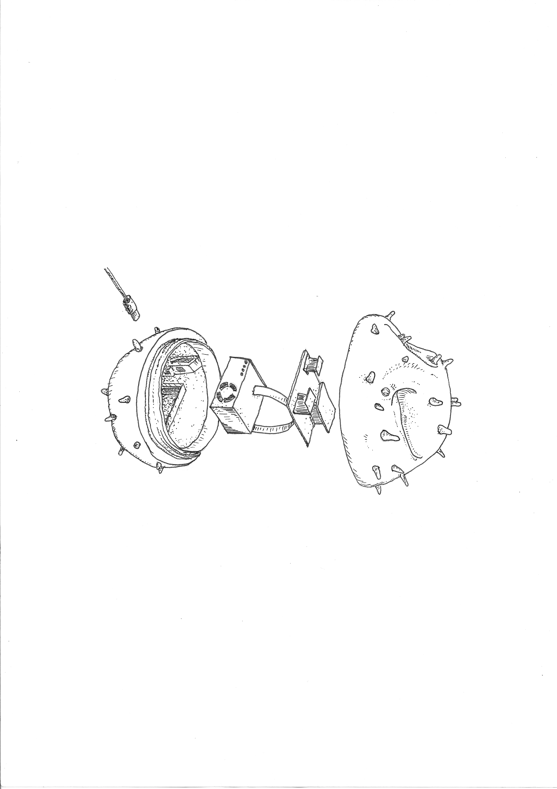 Dusbox 2.0 exploded to show the parts inside

## 3. Building a Dustbox 2.0 

The Dustbox 2.0 is a particulate matter monitor designed by Citizen Sense to undertake air quality sensing. We have designed the Dustbox 2.0 based on our experience of citizen sensing in the US and the UK, including with our [Dustbox 1.0](https://citizensense.net/kits/dustbox-hardware/). 

The shape of the Dustbox 2.0 resembles particulate matter, including pollen and diesel particles, when magnified under an electron microscope. The housing is 3D-printed. The Dustbox 2.0 uses a [Plantower PMS5003](http://www.plantower.com/en/content/?108.html) sensor to sense particles. These sensors have laser counters that measure airborne particulate matter. There is a small fan that draws air into the sensor and passes it through a laser that can detect the concentration and size of particles in the air. 

Every 60 seconds, the Dustbox 2.0 monitor measures 3 different environmental variables: (1) particulate matter, (2) temperature and (3) humidity. Such fine-grained data can help to observe and understand even small variations in the surrounding air. The Dustbox 2.0 connects to a Wi-Fi network using a microcontroller and sends data to the Airsift(airsift.citizensense.net/) platform for analysis. 

You can build your own Dustbox 2.0 following the instructions below. It is also possible to borrow a Dustbox 2.0 by emailing [info@citizensense.net](mailto:info@citizensense.net).

  Installing a Dustbox at the Horniman Museum and Gardens

To build the Dustbox 2.0 you will need to follow four steps:

1) **Gathering parts and tools:** There are two lists below for the parts and tools required to build your Dustbox 2.0. Parts are components that are used in the device, and tools are things used to make it. Please note that these parts and tools could change depending upon availability and technology updates.

2) **Assembling the electronics:** The electronic components need to be assembled and attached to the Dustbox 2.0 circuit board.

3) **Uploading code to the Dustbox 2.0:** To upload code to the Dustbox 2.0 it initially needs to be connected to your computer using a USB-TTL cable and driver. You will test whether the connection works by running a simple 'Blink' programme. Once this test is complete, you can upload the Dustbox 2.0 firmware to the electronics you have assembled.

4) **Assembling the Dustbox 2.0:** Once these steps are completed, you are ready to assemble the complete monitor, which involves placing electronic parts inside the enclosure.

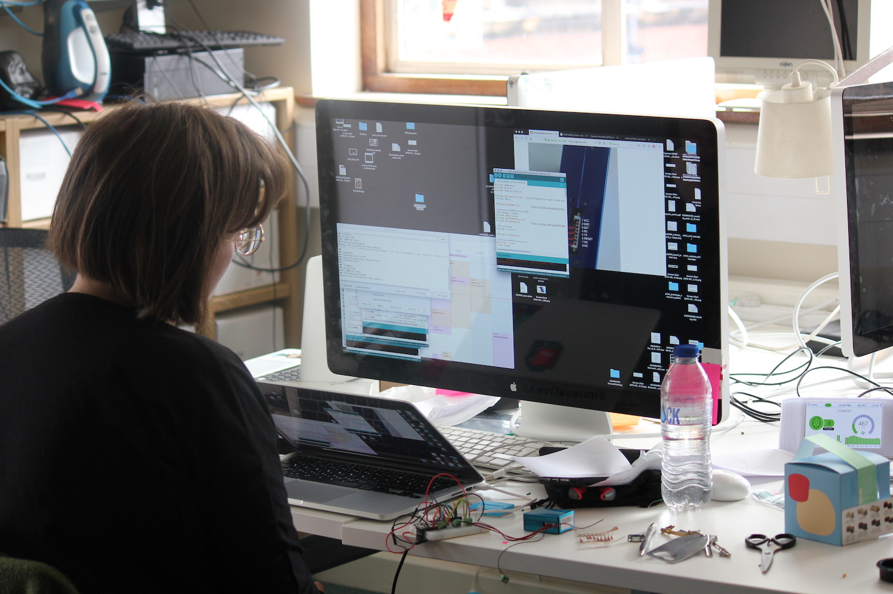
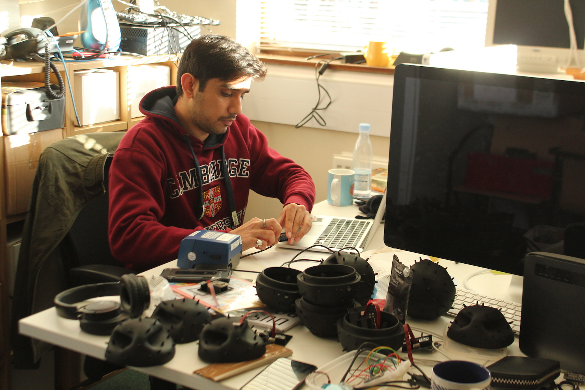
  Researchers working in the Citizen Sense lab

### 3.1 Gathering parts and tools
The components required to build the Dustbox 2.0 sensor are listed below and include resistors, sensors, an LED, an ESP8266 Wi-Fi board, and the Dustbox 2.0 printed circuit board (PCB). A full list of the parts and tools required to build the Dustbox 2.0 are provided below. Before you start to build the sensor it is important to have all the components available for assembly. When you are ready to begin building your Dustbox 2.0, your work station might look a bit like this:

 
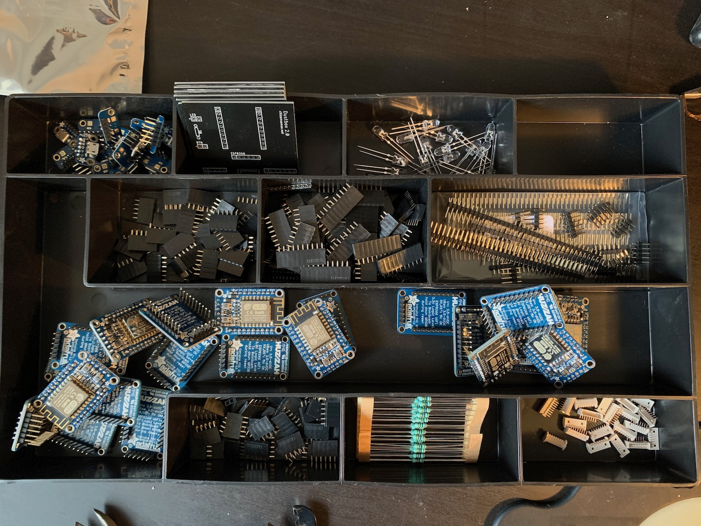 
 All the parts used in the Dustbox 2.0

#### Electronic parts:

* [Adafruit Huzzah ESP8266 Breakout (ESP8266)](https://learn.adafruit.com/adafruit-huzzah-esp8266-breakout "Adafruit ESP8266 Huzzah")
* [Plantower PMS5003](https://shop.pimoroni.com/products/pms5003-particulate-matter-sensor-with-cable "Pimoroni PMS5003")
* [Sensirion SHT31-D Breakout Board (SHT31-D)](https://wholesale.pimoroni.com/products/adafruit-sensiron-sht31-d-temperature-humidity-sensor-breakout "Mouser DHT22")
* [Adafruit USB Micro-B Breakout Board (USB Micro-B)](https://shop.pimoroni.com/products/adafruit-usb-micro-b-breakout-board?variant=821196557&currency=GBP&utm_source=google&utm_medium=cpc&utm_campaign=google+shopping&gclid=CjwKCAjwldHsBRAoEiwAd0JybS8f8x6MbMAIASIBfUMpfBvs9wamEiR84HmLGSBNeUsD_C1EzuftjxoCr8cQAvD_BwE "Adafruit USB Micro-B Breakout Board")
* [Molex PicoBlade 53048, 8-Way Connector](https://uk.rs-online.com/web/p/pcb-headers/2799308/?relevancy-data=636F3D3126696E3D4931384E525353746F636B4E756D626572266C753D656E266D6D3D6D61746368616C6C26706D3D5E2828282872737C5253295B205D3F293F285C647B337D5B5C2D5C735D3F5C647B332C347D5B705061415D3F29297C283235285C647B387D7C5C647B317D5C2D5C647B377D2929292426706F3D3126736E3D592673723D2673743D52535F53544F434B5F4E554D4245522677633D4E4F4E45267573743D32373939333038267374613D3237393933303826&searchHistory=%7B%22enabled%22%3Atrue%7D "Molex PicoBlade 53048, 8 Way")
* [10 Ω 0.4W Resistor](https://uk.rs-online.com/web/p/through-hole-fixed-resistors/1650640/ "10 ohm Resistor")
* [2 x 10 pin PCB Headers](http://www.hobbytronics.co.uk/cables-connectors/pcb-headers-sockets/header-female-1-10 "10 pin Header Sockets")
* [1 x 6 pin Header Socket](http://www.hobbytronics.co.uk/cables-connectors/pcb-headers-sockets/header-female-1-6 "6 pin Header Sockets")
* [1 x 5 pin Header Socket](http://www.hobbytronics.co.uk/cables-connectors/pcb-headers-sockets/header-female-1-5 "5 pin Header Sockets")
* [1 x 7 pin Header Socket](http://www.hobbytronics.co.uk/cables-connectors/pcb-headers-sockets/header-female-1-14 "14 pin Header Sockets")
* [1 x 4 Header Pins](http://www.hobbytronics.co.uk/40-header-male-double?keyword=header%20pin). NB you may have spare header pins from the breakout boards.
* 1 x [Long Socket to Socket Jumper Cable](https://uk.farnell.com/twin-industries/tw-fp-20/jumper-wire-24awg-20cm-pk10/dp/2850719)
* 2 x [Short Socket to Socket Jumper Cable](https://uk.farnell.com/twin-industries/tw-fp-5/jumper-wire-24awg-5cm-pk10/dp/2850720)
* [USB-A to USB Micro-B Cable 5ft in Riviera Blue](https://pexonpcs.co.uk/collections/usb-cables/products/usb-cables)
* [USB Plug Socket](https://cpc.farnell.com/pro-elec/pel00313/usb-charger-5v-1-2a-black/dp/PW03999?CMP=TREML007-005)
* [Clear LED](https://uk.rs-online.com/web/p/leds/7134024/)
* [Button](https://uk.rs-online.com/web/p/push-button-switches/8287826/)
* [Heat shrink](https://uk.rs-online.com/web/p/heat-shrink-cold-shrink-sleeves/8296066/) (optional)
* [Dustbox 2.0 printed circuit board (PCB)](https://github.com/citizensense/Airkit/tree/master/dustbox_2_0_PCB/GerberFiles)

#### Dustbox 2.0 enclosure
In order to build the Dustbox 2.0 you will need to print the 3D enclosure and PCB. The Dustbox 2.0 enclosure is designed to be water- and weather-proof to ensure that all electronic parts are protected. At the same time, the enclosure allows air to flow through to the sensor. 

There are two Dustbox 2.0 shapes **pollen** and **diesel char**. The diesel char design can be printed from these designs [**link to stl files TOP + BOTTOM**]. There is a hole in the bottom of the enclosure where a bolt can be inserted and connected to a shelf ([M8 x 38mm Stainless Steel Square Head Bolt](https://www.tradesignz.com/square-head-m8-x-ss-bolts-nuts-washers.html)). If you plan to use this design without a bolt, you need to print a rubber stopper [**link to STL files**] so that water cannot enter the bottom of the sensor. The **pollen** design [**link to STL files**] does not have a hole in the bottom so does not require the rubber stopper to be printed.

The prototypes we have built are produced by [Materialise](https://www.materialise.com/en) and printed in the Multi Jet Fusion PA 12 material. All you need to do is download the files at this link and send them to your preferred manufacturer. Printing the enclosure costs around €200 each. You can easily print the STL files yourself if you have access to a 3D printer. You should print with materials that offer some weather-proofing and UV resistance.

It is possible to create your own cheaper alternative so long as it is waterproof and protects the electronics. This could be a small box with holes drilled out for the power cable and sensor air inlet.

#### Dustbox 2.0 PCB
The Dustbox 2.0 PCB allows all electronics to be securely connected and attached to a circuit board. [Cambridge Circuit Company](https://www.cambridge-circuit.co.uk/) manufactured the PCBs that we have used in our field-tested Dustbox 2.0. To produce the PCB, select a local PCB manufacturer and send a copy of the [Gerber files](https://github.com/citizensense/Airkit/tree/master/dustbox_2_0_PCB/GerberFiles). Printing one PCB can be expensive as there is a one-off machine programming cost. It's best to order a couple of boards in case there are issues or mistakes in the soldering process.

#### Tools

* Soldering iron kit including a stand, sponge, solder remover, heat-proof mat, lead-free solder, fume extractor. 
* [USB to TTL Cable](https://thepihut.com/products/adafruit-usb-to-ttl-serial-cable "PiHut USB to TTL").
* Safety goggles
* Pliers
* Wire cutters
* Pen knife
* Electrical tape
* Breadboard
* Hairdryer or heat gun (if using heat shrink)

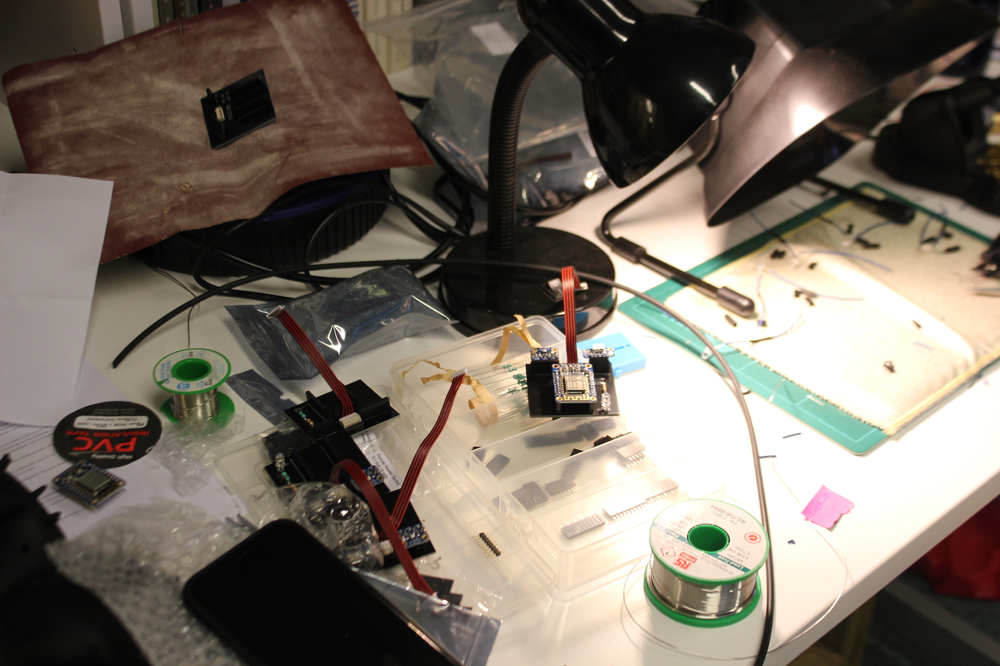 
 A view of the soldering desk in the Citizen Sense lab

 
#### 3.2. Assembling the electronics

There are two phases of soldering (1) soldering headers pins to the breakout boards (2) soldering components to the Dustbox 2.0 PCB. Below are some tips for soldering:
* Make sure that you give yourself plenty of time to complete the soldering task. A rushed solder joint is often a dud solder joint.
* It is important that you are working in a well ventilated space and that you have the correct equipment. This includes a stand to rest the iron on when it is not being used and a heatproof mat or work surface.
* Ensure that any trailing cables are secured and that the workspace is tidy.
* Lay out all your parts in the order that they will be assembled and keep these instructions to hand.
* Before turning the soldering iron on, make sure that the tip is securely screwed in and the device is in a good state of repair. 
* You can now turn on the soldering iron. If it is temperature controlled set the temperature to around 400 degrees.
* Make sure that your soldering iron is clean by wiping it on a damp or brass sponge. This is really important as a dirty iron will introduce unwanted particles into the solder and create weaker joints. The soldering iron will need a moment to get back to the correct temperature after cleaning.
* When the iron is hot enough take the solder and touch it to the tip of the iron. Make sure that the solder covers the tip evenly and flows well. You are now ready to solder the electronic components together.
* When you mount components on the board, push them through the corresponding holes and make sure they are flat and the legs are perpendicular.
* Once you are ready to solder a joint, heat the copper pad on the circuit board and the leg of the component with the iron. This will take a few seconds.
* With the iron still in place, touch the solder on the joint and remove once the solder has flowed around the pad and about 2–3 mm up the leg of the component.
* A good joint will be shiny and form the shape of a hill where the solder is flat to the bottom and forms a conical shape around the leg. 
* A bad joint will be dull. If it is in the shape of a ball you have not heated the copper pad enough and the solder has not attached to it. You can fix this by applying heat to the copper pad.
* Be careful not to hold the iron to the pad or legs for too long as it may damage them.
* Avoid introducing too much solder to the joint as this can make connections bulky and increases the chances of accidentally connecting two pads together. If this happens, use your solder sucker or wick to remove the excess solder.
* If you don't use enough solder the joint will be wobbly resulting in a poor connection.
* If you make any mistakes, reheat the solder and remove it with your solder wick or sucker.
* Remember to clean your iron at regular intervals!
* This is a basic overview of soldering. You will find some more detailed instructions below for each electronic component.
* If you have not soldered before, try and make a couple of test joints to get a feel for the process.

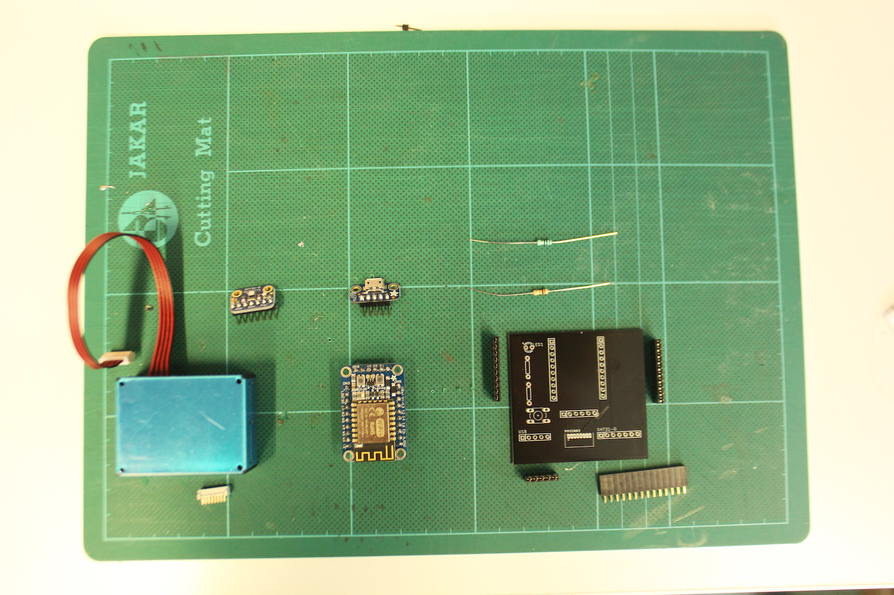
  The Dustbox 2.0 parts laid out
 

#### Soldering headers to breakouts

Breakout boards are PCBs that have been designed by companies to make electronics components easier to prototype with. A lot of modern electronics parts are very small and need to be soldered to the surface of PCBs. This can be a messy process if you don't have the correct equipment. A number of companies produce breakout boards for these components allowing hobbyists to use them at home. Breakout boards often require a small amount of assembly and normally arrive as a small PCB with holes in it and some header pins (or a strip of pins that fit through these holes). There are 3 breakout boards that we need to solder header pins for: Adafruit Huzzah ESP8266 Breakout (ESP8266), Sensirion SHT31-D (SHT31-D), and Adafruit USB Micro-B Breakout Board (USB Micro-B). You will need to attach the header pins to these boards. Header pins connect with sockets and allow us to securely connect different electronic components together. The advantage of using headers and sockets is that we can remove, re-use or replace components them without additional soldering.

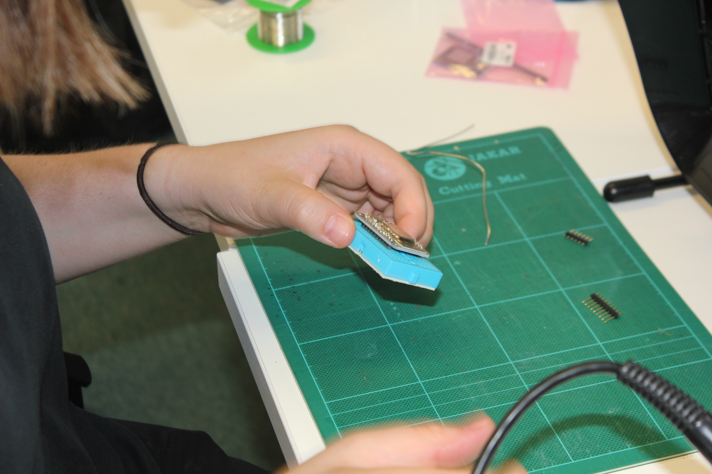
  Connecting the Adafruit Huzzah ESP8266 Breakout to pin headers
 

* The header pins are soldered to the pin holes in each PCB. Whilst most components come with their own header pins sometimes you may need to cut a few pins off. Make the cuts slowly and steadily as they can ping off.
* The best way to solder header pins to the PCB is using a breadboard. Place the cut-to-length header pins in a breadboard so the short ends poke through the top then place the PCB over top. It is important to make sure that the PCB is flat and that the header pins are perpendicular to the PCB. You can tuck heat-resistant items under the PCB to make it level, or just apply some extra pressure with your iron.
* You are now ready to solder the PCB. For further instructions on this step, see the soldering guide above in [Section 3.2](https://github.com/citizensense/Airkit/blob/master/toolkit.md#32-assembling-the-electronics) (also on **page XX** of the print or PDF Logbook [**add**]).

#### Soldering components to the Dustbox 2.0 PCB

Once the breakouts are fully assembled you are ready to solder parts to the Dustbox 2.0 PCB. The PCB has two sides you can tell them apart as the top side has some text on it. We will solder all components to the top side of the board. It is best to solder low-profile components like resistors first, this can be done in stages grouping similar height parts together.

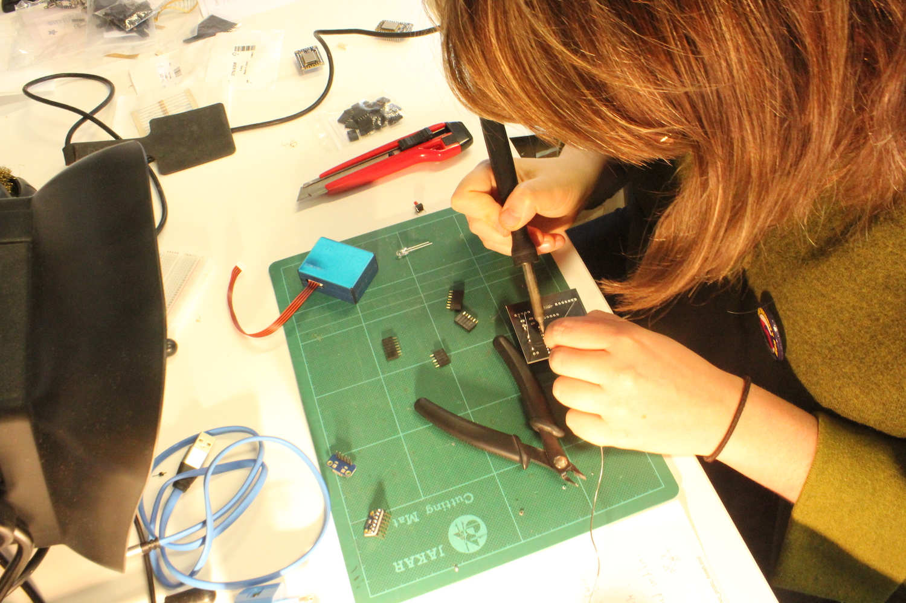
  Connecting parts to the Dustbox 2.0 PCB

* Pop the 10 Ω (R1) through hole resistor into the PCB. You will need to bend the resistor wire to a right angle. You can use a pair of pliers to get a tidy bend. You may need to use the pliers to pull the resistor through the hole so that it sits flat on the PCB surface. You can secure the resistor in place using some electrical tape, flip the board over and solder.

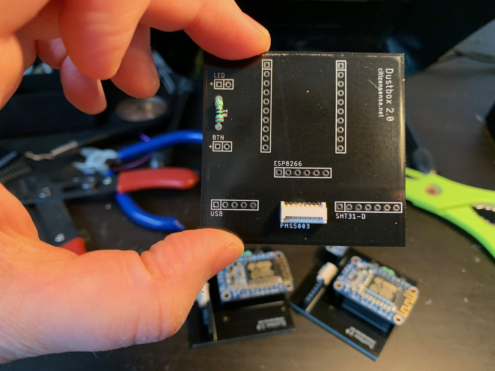
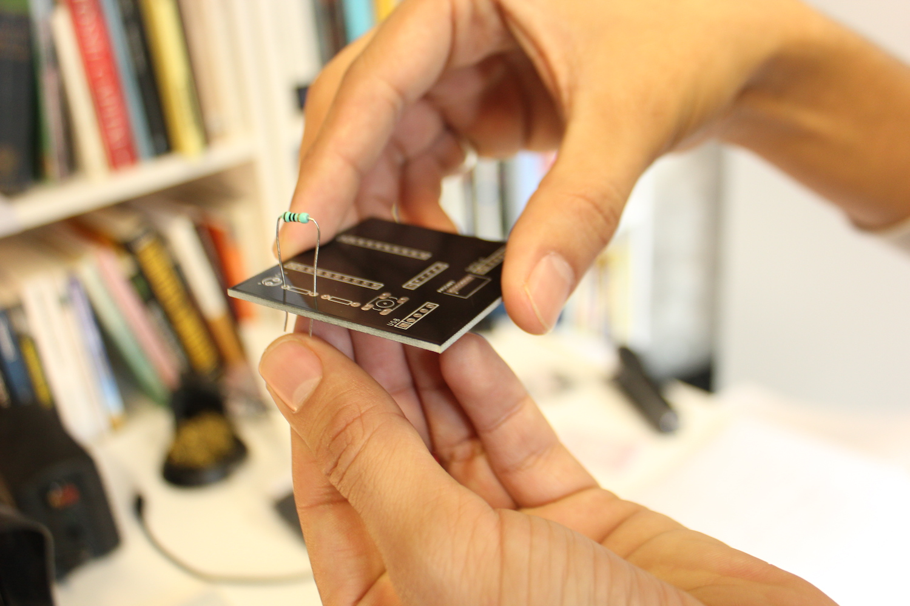
   Solder the low-profile components to the Dustbox 2.0 PCB first
 

* Place the Molex PicoBlade 53048 in the PMS5003 slot. Make sure that the connector pins are facing the outside of the board. Solder this component carefully as the spaces between pins are small and if you use too much solder, pins can join together.

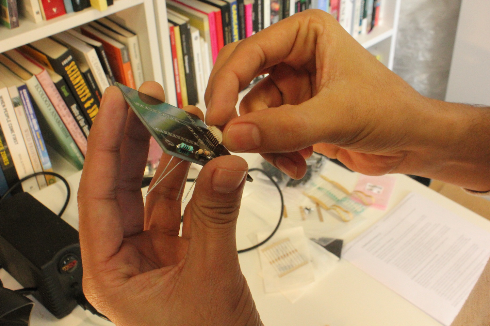
  Insert the Molex PicoBlade connector in to the PCB slot

* Next solder the header sockets that breakout boards (ESP8266, SHT31 and USB port) will be attached to. Solder them two at a time to balance the board flat on your work surface. It is important to keep the sockets perpendicular to the board. 

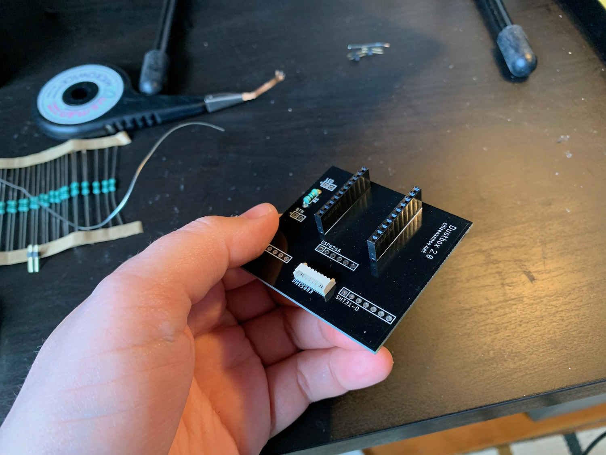
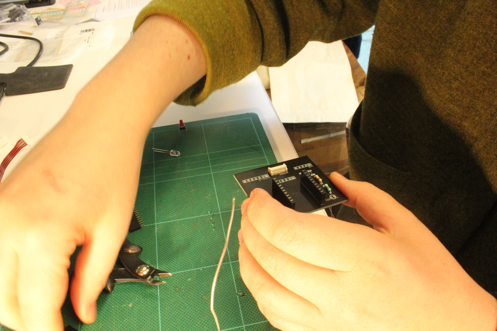
   Add the header sockets to the PCB ensuring they are perpendicular

* Use the correct size socket for each part. Note that you may need to cut them down. 

* When attaching header sockets, you can hold pins in place using some pliers as you flip the board over to solder.

* Next, solder header pins to the button and LED holes. The shorter legs should poke through the hole and the longer legs should poke out the top of the board.

* Once you have finished soldering, snip off legs of the resistor to just above the solder joint using the wire cutter. You do not need to snip the Molex PicoBlade 53048 or sockets.

[** NB IMG20_rev2_boards_soldered_no_breakouts_top_view.jpeg removed from here **]
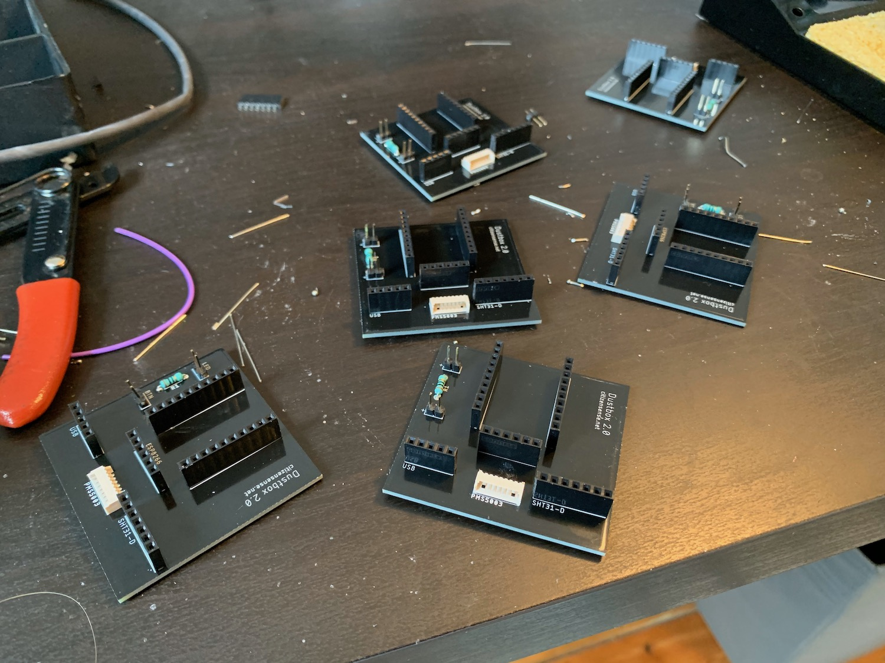
   Dustbox 2.0 PCBs fully soldered.
 

* The LED is attached to the circuit board using two jumper wires. These wires should be around 4cm long, flexible and have sockets at each end. This does not require any soldering.

* The button requires soldering so that we can connect it to the circuit. First, unscrew the black ring from the bottom of the button. Keep this aside as you will be using it later.

* Take a jumper wire with a socket at the end and cut the wire to around 25mm. Strip off around 1cm of casing to expose the inner copper wire.

* If the wire has multiple strands, hold the end in your hand and neatly twist it. 

* You are attaching wire to two of the three legs on the button (1) the long leg and (2) the leg with a '+' sign by it. 

 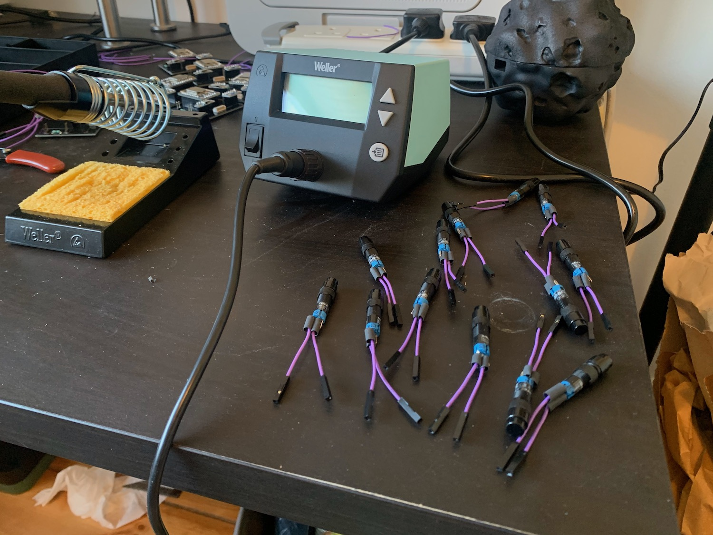
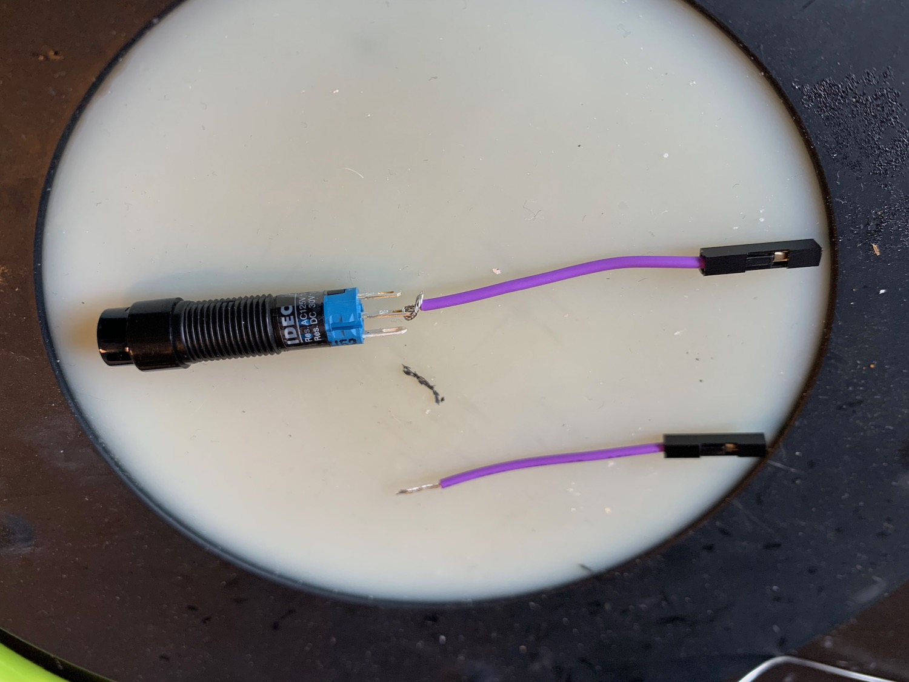
   Loop the jumper wire around the button hooks 

* Take the exposed wire and loop it around the hooks, snip off an extra exposed wire. 

* Apply solder to hold the wire in place, make sure that the solder flows over the entire hole for a secure connection. 

* If the connections are bulky you may want to use some electrical tape or a small piece of heat shrink to ensure they don't touch.

 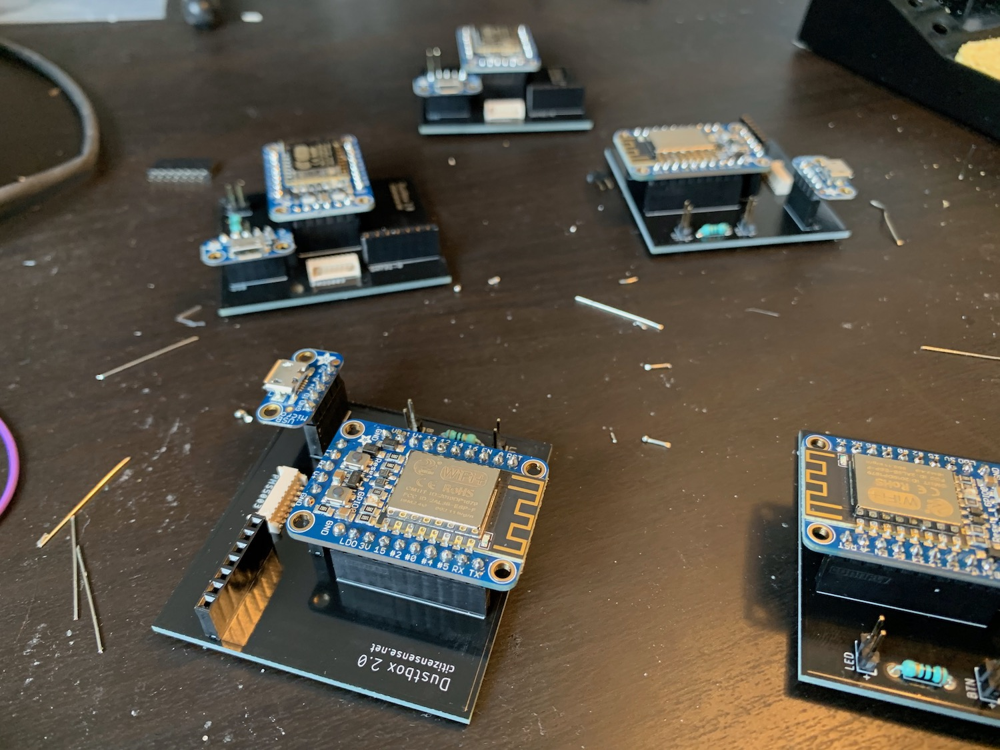
  Dustboxes with breakout boards attached
 

* Once you have finished soldering, you can attach all the breakout boards and sensors to the PCB. You will need to take the ESP8266 out again to program it.

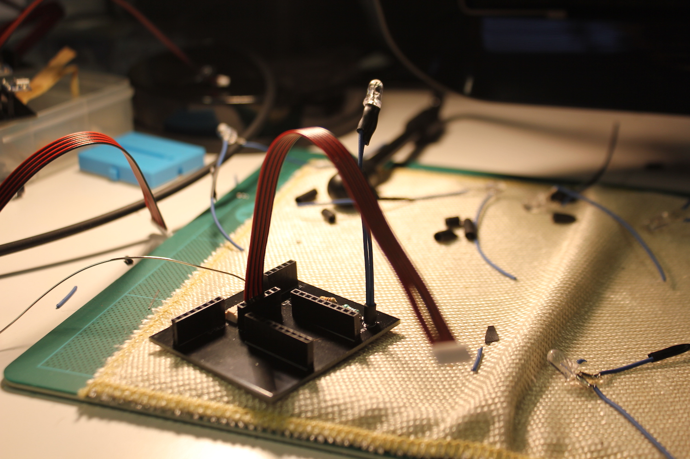
  Dustbox 2.0 PCB without breakout boards

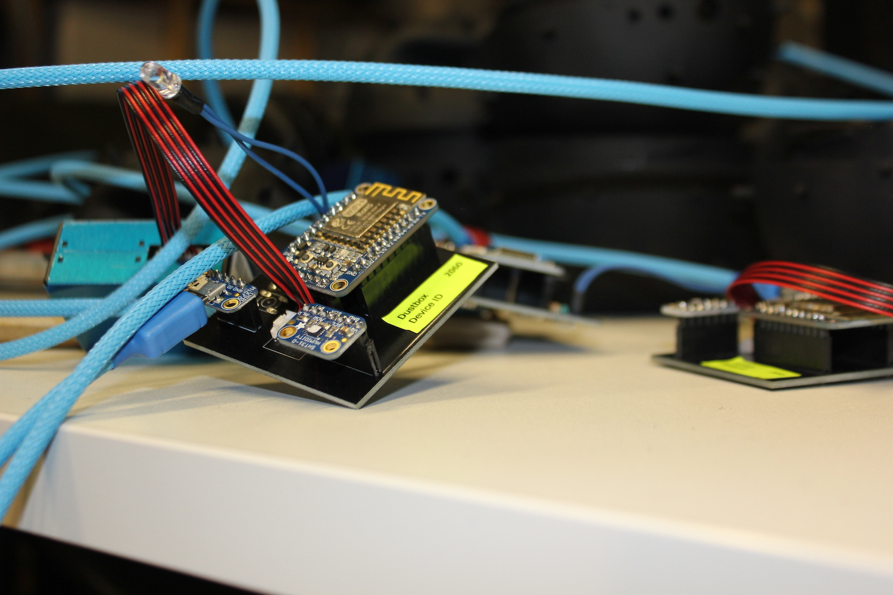
   Dustboxes fully assembled and powered

### 3.3. Uploading code to the Dustbox 2.0

The Dustbox 2.0 firmware needs to be uploaded to the Adafruit Huzzah ESP8266 Breakout using the Arduino IDE so that you can send data to the Airsift platform. This process requires you to use the USB to TTL cable. First, you need to install the [Arduino IDE](https://www.arduino.cc/en/main/software "Download Arduino") on to your computer. 

#### Install USB to TTL cable drivers

You need to install the [PL2303 driver](https://pbxbook.com/other/mac-tty.html "PL2303 Driver") in order to use the USB to TTL cable and connect your computer with the Adafruit Huzzah ESP8266 Breakout board.

Connect the USB end of the cable to your computer. Attach the 4 socket cables as follows:

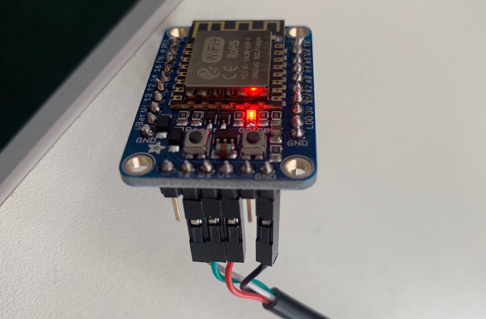
  Connect the TTL cable to the Adafruit Huzzah ESP8266 Breakout

| Adafruit Huzzah | TTL Cable       |
| --------------- |:---------------:|
| GND             | Black           |
| V+              | Red             |
| RX              | Green           |
| TX              | White           | 
 
Table to show how to connect the TTL cable to the Adafruit Huzzah ESP8266 Breakout

** The RX and TX may be the other way around on your cable.

#### Connect the ESP8266 board to your computer

Once your computer and ESP8266 are connected you should see two illuminated LEDs. This means that your computer is providing power to the ESP8266 and it is switched on. We aren't quite ready to upload the code yet.

#### ESP8266 board package

* Open the 'Preferences' window in the Arduino IDE (CMD + , on mac).

* Under the settings menu, navigate to 'Additional Boards Manager URLs' and copy-paste the following URL into the box. If you have multiple URLs you can separate them with commas. Click 'OK' and return to the main Arduino IDE.

`http://arduino.esp8266.com/stable/package_esp8266com_index.json`

* Navigate to the **boards manager** window via Tools > Board > Boards Manager... and search for 'ESP8266'.

* Install version **2.5.0** of 'esp8266 by ESP8266 Community'.

* Close the window.

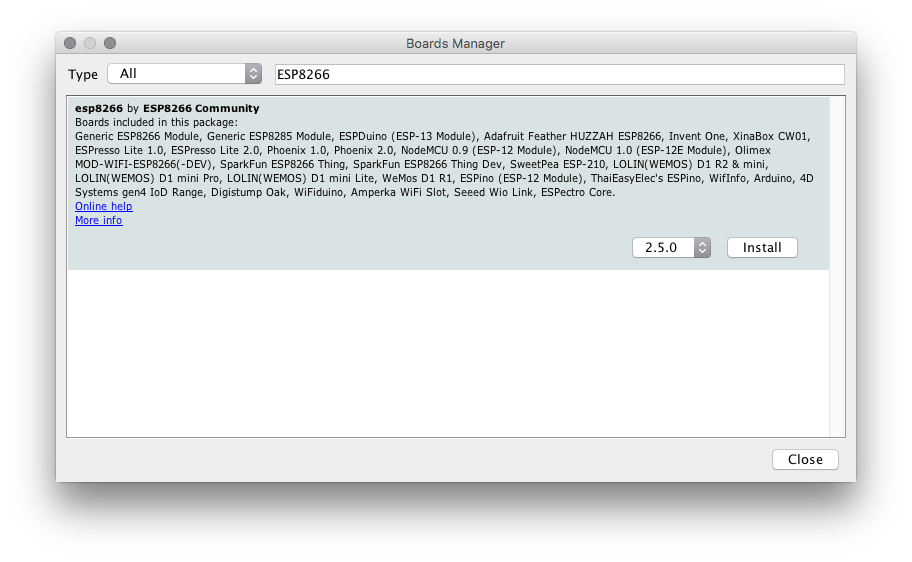
   Screenshot of the Boards Manager window in the Arduino IDE
 

#### Connecting the ESP8266 board

You should now be able to view and select **Adafruit Feather Huzzah ESP8266** from Tools > Board (under 'ESP8266 Boards (2.5.0)'. Note that the naming of this is slightly different from the board that you are using, but it works. Once you have selected the Adafruit Board, return to the Tools > menu and:
* Set the CPU frequency to 80 MHz. 
* Set the Upload Speed to 115200.
* Set the Port to the USB Serial/COM for the USB to TTL cable (depending upon your operating system this could be differently labelled).

#### Adding required libraries

Some libraries need to be added to the Arduino to run the code. To add a library to Arduino navigate to Sketch > Include Library > Manage Libraries... Search for and install the following libraries:
* **WiFiManager** by tzapu Version 0.14.0
* **DHT sensor** library by Adafruit Version 1.3.7 (you may need to install dependent libraries as well)
* **ThingSpeak** by MathWorks Version 1.5.0
* **PMS Library** by Mariusz Kacki 1.1.0
* **FastLED** by Daniel Garcia Version 3.2.1 
* **SHT31 Library** by Adafruit Version 1.1.2
* **NTPClient** by Fabrice Weinberg Version 3.2.0

#### Uploading code

You can test the connection between your computer and the ESP8266 by uploading the 'Blink.ino' example code from your computer to the ESP8266. 

First, check that you have selected the correct board (Adafruit Feather HUZZAH ESP8266) and the correct port selected (either COM or /dev/cu.usbserial depending on your operating system and cable), which will be noted in the text at the bottom of the Arduino IDE window.

Every time you upload code the ESP8266 board needs to be put into bootload mode, which allows it to receive code. To do this: 

* Hold down the **GPIO0** button (red LED bright)
* Still holding **GPIO0** press the **RESET** button (adjacent to the red LED bright button)
* Release the **RESET** button then release the **GPIO0** button (which should now be a dimmer red LED)

There is no timeout for this mode as the bootload mode is continuous, so you can continue to the upload code button in Arduino when you are ready.

You can find the 'Blink.ino' example code in the Arduino IDE. Navigate to File > Examples > Basics > Blink.

In the Arduino IDE press the upload button which is the arrow pointing right at the top of the Arduino IDE window. In the bottom left corner of the window you will first see the message 'Compiling Sketch'. This means that the Arduino IDE is checking the code for errors and preparing it to be uploaded to the ESP8266 board. After this the message will change to 'Uploading...' and when the upload is complete it will change to 'Done uploading'. In the black box at the bottom of the window, text will note the status of the upload and any errors  
* The red LED on the ESP8266 should blink on and off every second.
* You may see an error message related to the ESP8266. You can test whether your computer is communicating with the ESP8266 by changing the delay(1000) common on line 34 to delay(100). Then compile and upload the code to see if the blink rate is faster to confirm a successful upload.
* See [Arduino Troubleshooting](https://www.arduino.cc/en/guide/troubleshooting#toc1) for common errors.
* Now you are ready to upload the Dustbox firmware to the device.

If you have built your own Dustbox you will need to contact the Citizen Sense team [info@citizensense.net](mailto:info@citizensense.net) who will create a new stream for you to pipe data to. This process will also generate a unique public and private key for your device that will allow it to communicate with our server. We will send you the code that you need to upload to the device which will be based on this template [**link to code**].

To upload the code to the ESP8266 you will need to place it in bootload mode and following the instructions above with the new file. To test that your Dustbox 2.0 is working and piping data, see the instructions for connecting it to your local Wi-Fi in [Section 4.4](https://github.com/citizensense/Airkit/blob/master/toolkit.md#44-connecting-your-dustbox-20-to-a-wi-fi-network) below and on page [**XXX**] of the print or PDF AirKit Logbook.

#### Firmware

To set up your own Dustbox firmware, you should first email the Citizen Sense team [info@citizensense.net](mailto:info@citizensense.net) who will assign you a Dustbox number, public key and private key.

Each Dustbox has a separate firmware file that includes a set of functions to start the Wi-Fi manager, connect to the network, read the sensor data, send the data to the server and check if there is any updated firmware available. The Citizen Sense server holds the current firmware version as well as any firmware update. The firmware file includes all functions for sensing particulate matter, temperature and humidity data, as well as sending data on these three variables to the Citizen Sense server over a secure transmission channel. The data transmission is done using a set of keys for identifying the Dustbox stream. When the device is awake, an HTTP connection is set up and the data is sent in the form of a GET request. Once the response is received from the server, the connection is closed and the device goes back to sleep. The data is posted using GET and POST requests that are based on public and private keys provided by the Citizen Sense platform when creating a data stream. The sensed data can be viewed at on the [Airsift](https://airsift.citizensense.net/) platform.

We use an Over the Air (OTA) method for remote programming the Dustbox. This means that if a new firmware version is available and the Dustbox needs to be updated, it can be done remotely using OTA. Each Dustbox 2.0 has two files stored at the server. One is the .bin file that is the firmware image. Along with each firmware image there is a simple text file with a single line containing a version number. For example: in case of Dustbox 2062, there would be two files:

* **dustbox2062.bin** - This file includes the firmware image that can be generated by using the "Export Complied Binary" in the Arduino application. The binary files (.bin) would be stored in the same folder where the Arduino code (.ino) is stored. Every time a binary file is generated, it would be in the form of "dustbox2062.ino.adafruit.bin". Remember to rename it as your Dustbox name, for this example "dustbox2062.bin", before it is saved in the server.
* **dustbox2062.version** - This is a plain text file and includes the version number. Once you save it to the sever, it will appear as "dustbox2062.version.txt". Remember to rename it to "dustbox2062.version". When the Dustbox checks for the update, it verifies the version number. If a new version is available, it will automatically update the Dustbox. Here are some pictures to show how the update works:

* If there is no update available

  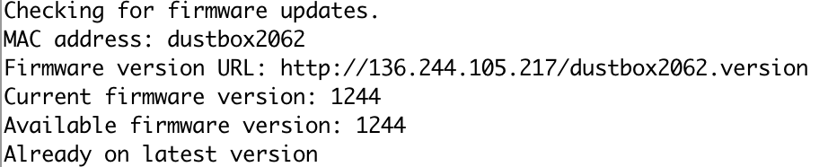
         
* If there is an update available

  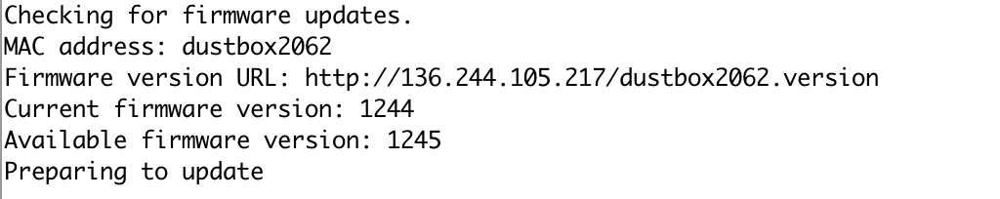
  
The Dustboxes check for an update after the sensor readings are sent to the server. When connecting to the firmware server, this takes about 20ms extra time.

To set up your own Dustbox firmware, you need to email the Citizen Sense team [info@citizensense.net](mailto:info@citizensense.net) who will assign you a Dustbox number, public key and private key.

#### 3.4. Assembling the Dustbox 2.0

Once you have soldered the PCB and have your 3D-printed enclosure, USB cable and plug socket, you are ready to assemble the Dustbox 2.0.

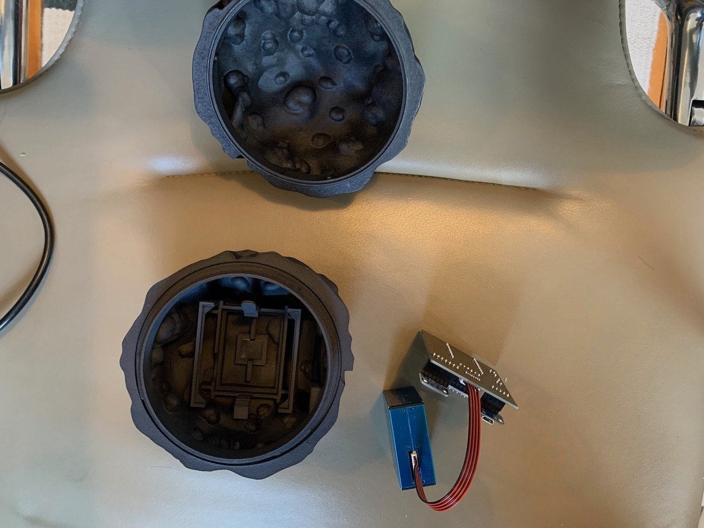
   The Dustbox 2.0 enclosure and completed PBC
 

1. From the bottom of the 3D-printed enclosure you will notice that there is a hole and two levers. If you wish to secure the sensor with a bolt, you can place the bolt through the bottom of the device. If you do not wish to use a bolt, you can seal the hole using the rubber stopper. 

  Diesel char Dustbox with bolt attached
 

2. With one hand, use two fingers to push down on the levers either side of the hole. Insert the bolt or stopper with your other hand. If using the stopper, check the underside to make sure that the hole is filled. You may need to push down a bit from the top to get the stopper fully in place.

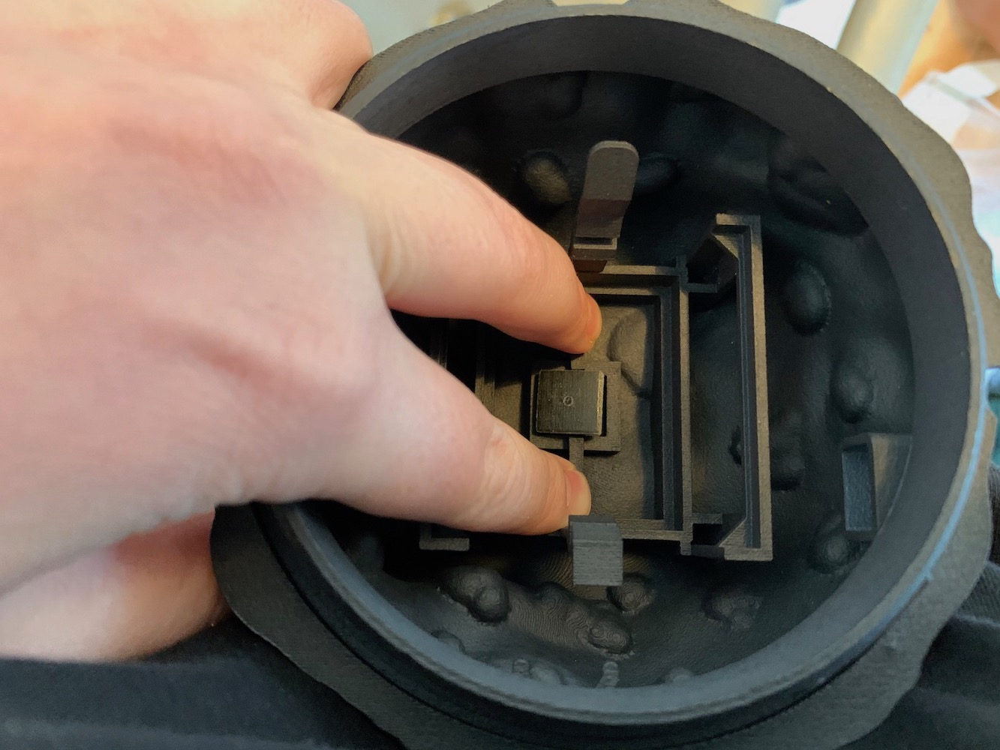
  Inserting the bung into the diesel char Dustbox 2.0

3. Take the PMS5003 sensor and connect the black and red cable that came with it. Inspect the bottom of the 3D enclosure and locate the rectangular hole (USB hole). Loop the other end of the black and red cable through the frame and up the side of the enclosure.

4. Place the PMS5003 sensor into the cradle at the bottom of the enclosure ensuring that the fan is lined up with the air vents the other side. Make sure that the sensor sits flat and clips into place.

5. Now that the sensor is in place, connect the other end of the red and black cable to the connector on the PCB. Make sure that the cable is flat. These connectors can be a bit stiff.

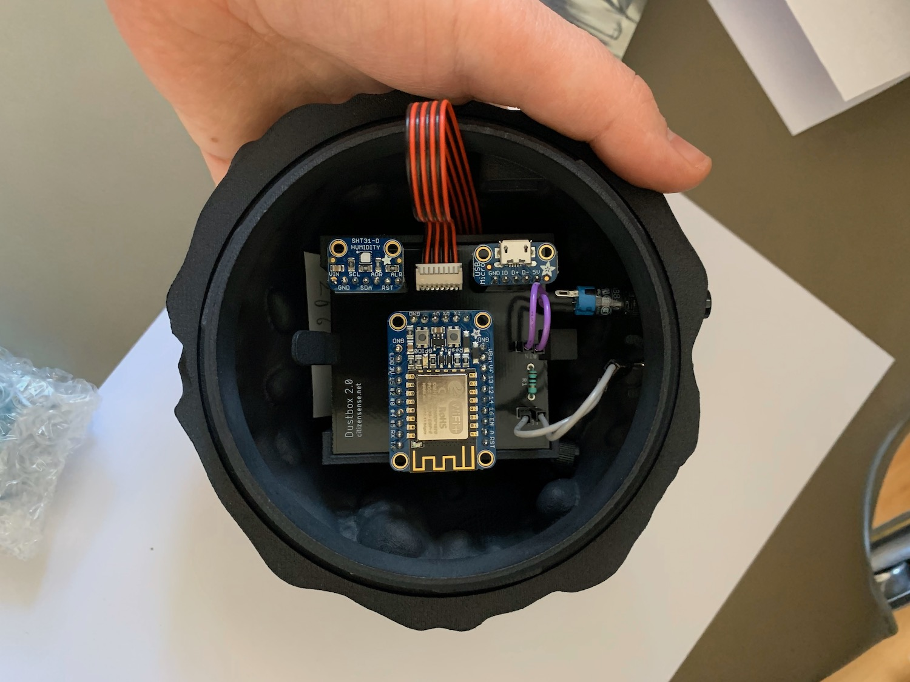
 Bottom of the assembled Dustbox 2.0

6. The PCB rests in the upper frame and is secured using the clips either side. Clip the PCB into place ensuring that the PCB header pins for the button and LED are next to the corresponding holes in the enclosure. The USB connector should line up with the USB hole. Make sure that the PCB sits flat and is fully clipped in to place.

7. If you have not done so already, place the ESP8266, SHT31, and USB breakout boards in the sockets as labelled on the PCB.

8. Cut approximately 3 mm off the short leg and 3 mm off the bottom leg of the LED. Take the two short socket-to-socket jumper cables and securely attach one to each leg. Attach the long leg of the LED to the header pin labelled "+" and the short leg to the neighbouring header pin. Gently bend the cables and place the LED into the smaller circular hole. Twist it around to secure it in place.

9. From the outside of the enclosure, insert the button into the larger circular hole. Take the black screw cap that you removed from the button, thread the legs through it and screw it back on as far as possible. The smooth side goes on first. The button may seem a little loose but it will be secured when the wires are attached to the PCB.

10. On the PCB, locate the two header pins labelled 'BTN'. Attach the '+' leg of the button to the '+' on the board. This will be covered by the clip that holds the PCB into place). Attach the socket connected to the long leg of the button to the adjacent header pin. 

11. Insert the USB cable through the USB hole. It can be a little stiff to connect to the USB socket, so place your finger at the back of the USB breakout board to support while you push the cable in. It might look like the cable is not fully connected but the overhang is around 2 mm. 

12. The device is now assembled and you just need to put the lid on. Line up the two embossed dots on the sensor lid and base. Slot them together and twist clockwise until you feel a click.

13. There can be some small margins of error when 3D-printing. You may find that you need to file down some holes to create a bit more space for parts or use electrical tape to pad space out a bit.

14. Connect the USB plug socket to the end of the USB cable. Your device is now ready to be switched on.

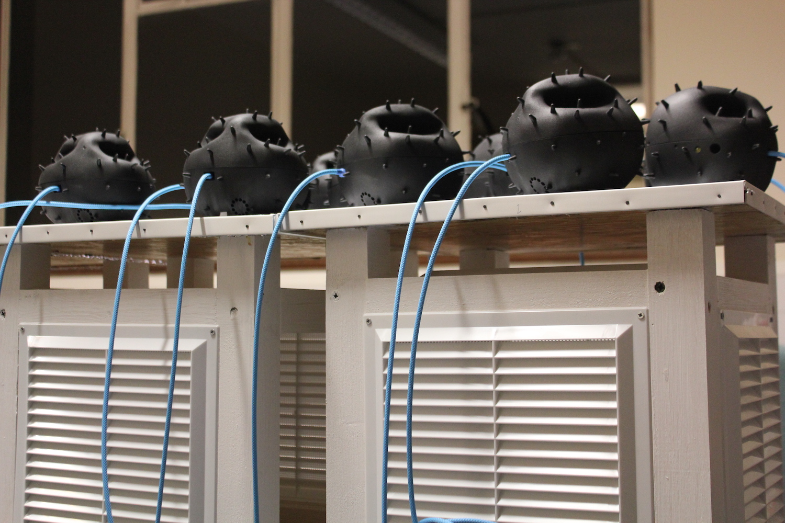
 Completed Dustboxes on Stevenson screens

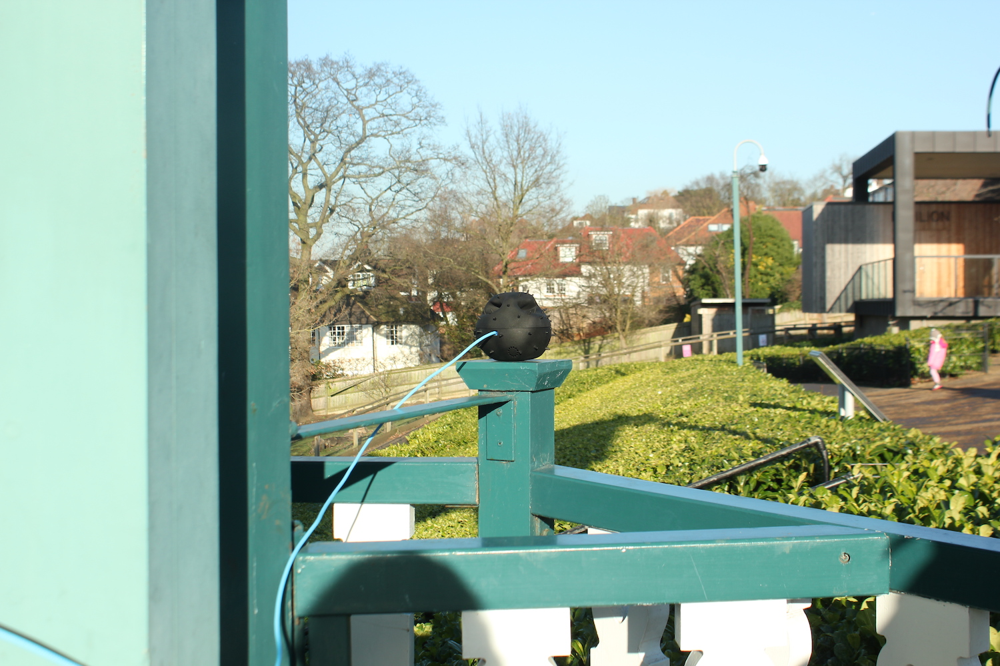 
  Dustbox 2.0 at the Horniman gazebo
 

## 4. Setting up Your Dustbox in the Field
To set up your Dustbox for monitoring, you will first want to undertake a few steps to ensure the accuracy of your device. These steps are outlined below. Once you have tested the accuracy of data, you can then proceed to install the Dustbox in monitoring locations. These steps are also outlined in more detail in this section.

## 4.1. Calibrating your Dustbox 2.0

To measure the accuracy of your Dustbox 2.0 you can perform a week-long calibration with industry-grade sensors. The calibration should be performed outdoors which helps to understand how the sensors work in outdoor environmental conditions like your garden.  

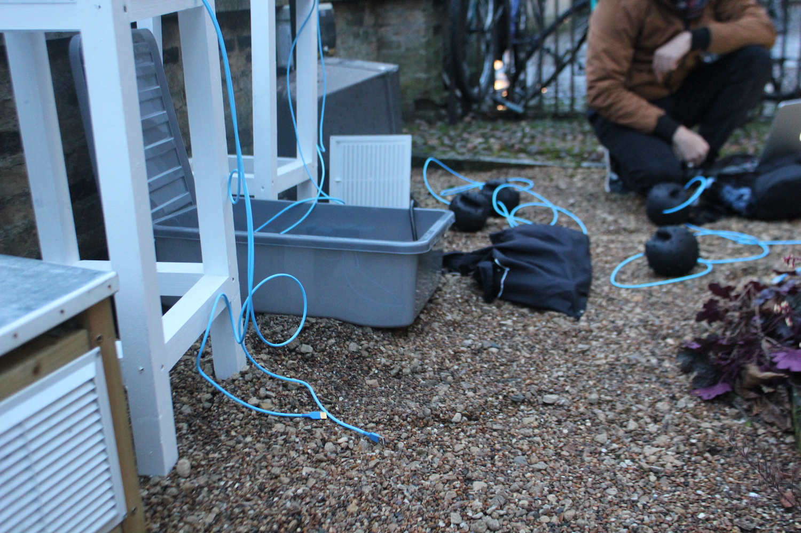
 Setting up sensors for calibration

 	
### 4.2.1. Co-locating your Dustbox 2.0 with the TSI AM520 (Sidepak) reference monitor
    
To calibrate the Dustbox 2.0, we undertook outdoor co-location with the TSI AM520, which is an industry-grade reference monitor. A co-location experiment gives an idea about how the data from Dustbox 2.0 compares with an industry-grade instrument. This is an important step for quality control and for evaluating the data accuracy of the Dustbox 2.0. Based on the co-location results, a correction factor can be added to the Dustbox 2.0 readings if needed. You can hire a TSI AM520 from your local air quality monitor hire company. We used [BSRIA](https://www.bsria.com/uk/product/Vn2M2r/tsi_am520_c531e0e5/) to hire a TSI AM520. Plan to collect data for a period of 4 to 7 days at a sampling rate of 1 sample per minute. 

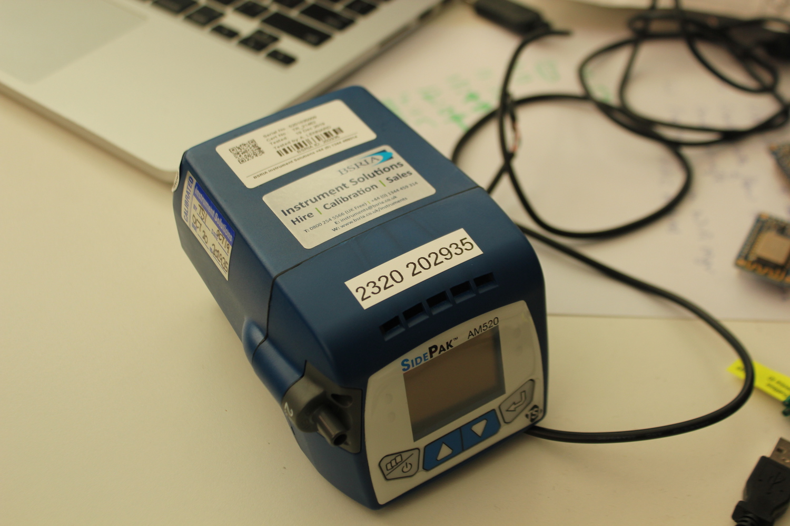
  Configuring the Sidepak reference monitor
 

Where you perform the co-location is important. When possible, try and choose a location where pollution levels are likely to change throughout the day such as nearby a traffic intersection (with peak and non-peak hours). These variations can provide an ideal place to sense and test variations in air quality. The Dustboxes and TSI AM520 should be placed near to each other and in a screen that is around 1.0 m to 1.5 m high. A Stevenson screen could come in handy here, if you need a free-standing structure for locating your Dustbox 2.0. See [Appendix 2](https://github.com/citizensense/Airkit/blob/master/toolkit.md#appendix-2-building-a-stevenson-screen) for instructions for how to make your own screen. 

    
   
  Transporting Stevenson screens for calibration
 

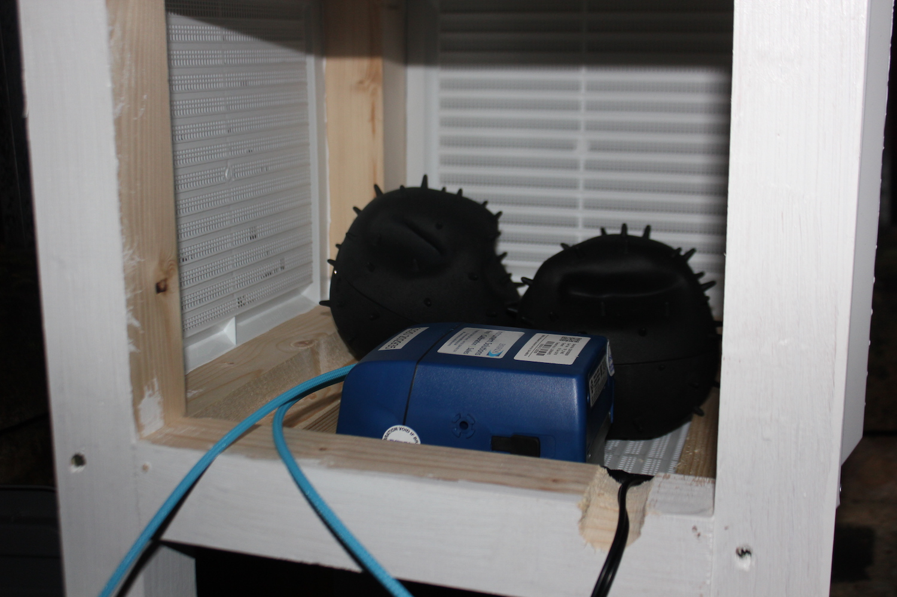  
  Sidepak and Dustboxes inside a Stevenson screen
 

    
TSI AM520 comes with a battery and impactor kit that holds impactor inlets (for different PM sizes), impactor disc and oil. While setting the device up, it is recommended to fully charge the battery. If the AC adapter is left plugged into the battery, the device will automatically disconnect once the battery is fully charged. Once the device is switched on, it is in survey mode and shows the date, time, battery, calibration factor and pollution concentration level. 

The device will start recording the data once the data logging mode is selected using the function keys on the device. Also, there are several data logging intervals available for the device. Based on the requirement, different logging intervals can be chosen by using the function menu of the device. For more details about how to use the device, understand different functions and visualize and download data, you can refer to the official [TSI AM520 manual](https://www.fieldenvironmental.com/assets/files/Manuals/TSI%20SidePak%20AM520%20Aerosol%20Monitor%20Manual.pdf).

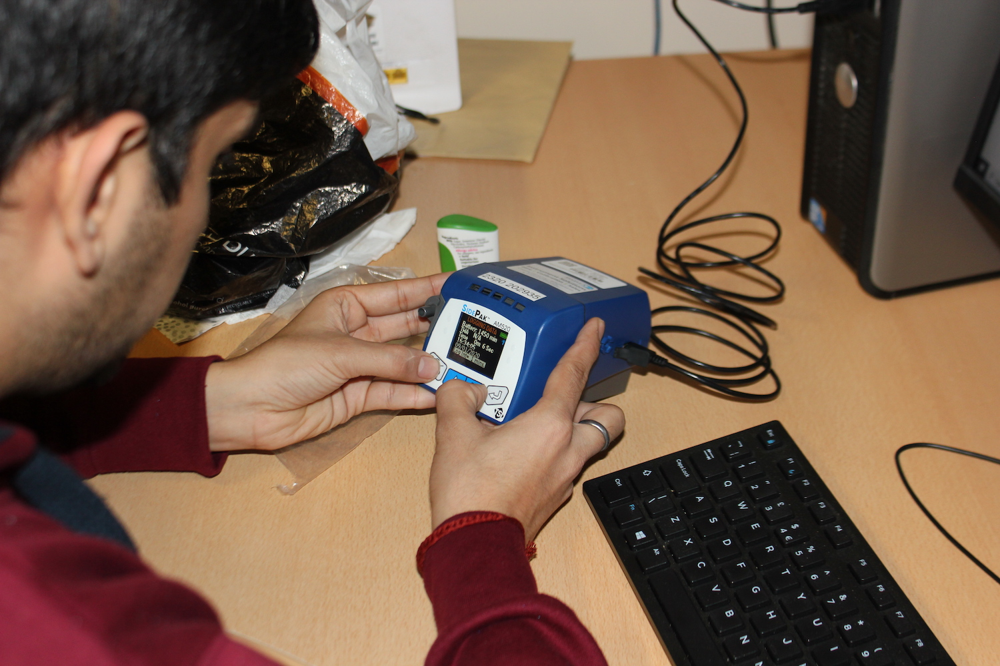  
  Configuring the Sidepak for calibration
 

The data from the Dustbox will be available to download as a CSV file using [Airsift](https://airsift.citizensense.net/). Just navigate to the [Dustboxes](https://airsift.citizensense.net/dustboxes/) page, click on 'Analyse Data', add in the dates from the co-location exercise and select 'download as CSV'.

Before you combine the different sensor data you need to do a small amount of data processing. The data from TSI AM520 is in mg/m^3, so before you can compare the TSI AM520 data with Dustbox data you need to convert the TSI AM520 data into µg/m^3. For this, open up the csv file of data in your preferred spreadsheet application (i.e., Excel, LibreOffice) or programming environment (i.e. Python, MatLab, R) and multiply all the PM data by 1000. Once the conversion is complete all the data can be combined for comparison. To compare data, look at the TSI AM520 data and establish what time data collection began. Open up the Dustbox data CSV and look for the corresponding time, and select the column labelled PM 2.5. Copy across both data sets into a new spreadsheet ensuring the times correspond to the minute.
    
You can use several data analysis methods for analyzing the PM2.5 data from Dustboxes and TSI AM520:

You can create a line/scatter plot using the combined data from the CSV file. This can be simply done using the graph feature in your preferred spreadsheet application or plotting libraries in [R](http://www.r-tutor.com/elementary-statistics/quantitative-data/scatter-plot). 

These plots give you an idea about how the Dustboxes are able to sense variations in PM level in comparison to the reference instrument. Look at the sudden peaks in the reference instrument's data and see if the Dustbox matches those peaks. This would give you an idea about the sensitivity and accuracy of the Dustboxes.
    
The next step involves understanding the correlation between the Dustbox data and the TSI AM520 data. You can calculate the Pearson Correlation, a number between -1 and +1 that indicates the extent to which two variables are linearly related. +1 means total positive linear correlation, 0 means no linear correlation and -1 means total negative linear correlation. You can calculate this value using the [Pandas](https://pandas.pydata.org/pandas-docs/stable/reference/api/pandas.DataFrame.corr.html) [https://pandas.pydata.org/pandas-docs/stable/reference/api/pandas.DataFrame.corr.html] package in Python or by using the [correlation function](https://support.office.com/en-gb/article/correl-function-995dcef7-0c0a-4bed-a3fb-239d7b68ca92) [https://support.office.com/en-gb/article/correl-function-995dcef7-0c0a-4bed-a3fb-239d7b68ca92] in Microsoft Excel. In our co-location of the Dustbox 2.0, we observed that the R value was 0.92 for indoor colocation and 0.98 for outdoor colocation for 1-hour averaged data. 

The plots below compare the performance (for 1-minute sampling) of Dustbox 2.0 devices with TSI AM520 in indoor and outdoor environments. The plots are generated using a [Plotly](https://plotly.com/?_ga=2.117570953.1255396492.1595945266-307745035.1594079626) [https://plotly.com/] tool.

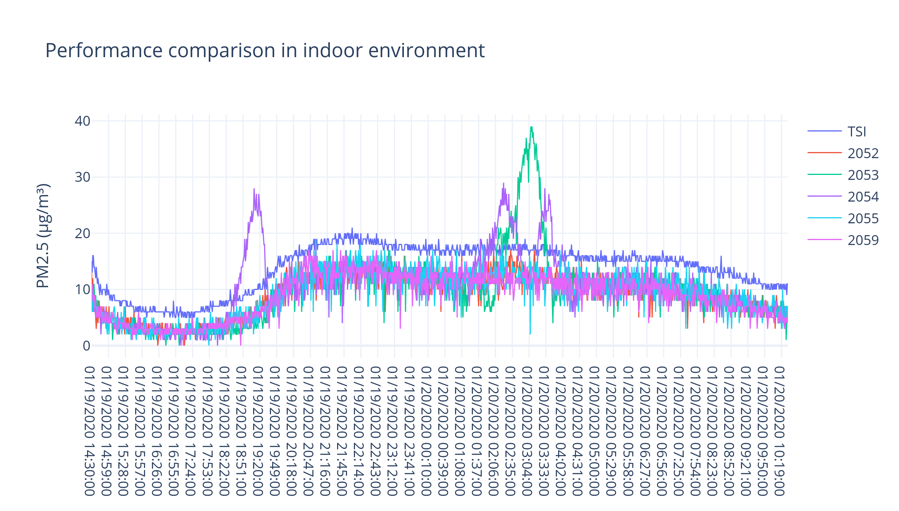  
  Line plot of TSI and Dustbox data sampled every 1 minute in indoor environment
 

 
 

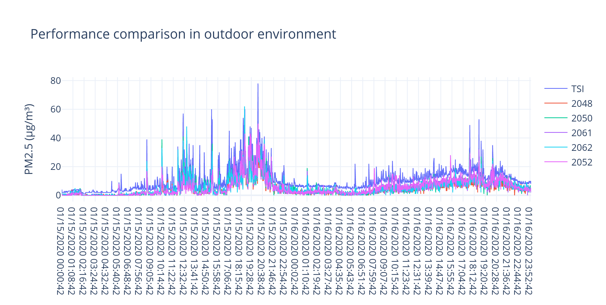  
  Line plot of TSI and Dustbox data sampled every 1 minute in outdoor environment
 

### 4.3. Installing and locating your Dustbox

Where you place the Dustbox in your environment depends on what you are trying to monitor. If you are trying to monitor a specific pollution issue you should place the Dustbox in proximity to the emissions source. If you are trying to establish general levels of pollution away from obvious sources, place your Dustbox 2.0 in a background location such as a garden or greenspace. Once you have decided where to site your Dustbox 2.0, carry out a pre-installation inspection of the monitoring site to ensure its suitability by following these steps:

* Select a location that is outdoors but reasonably sheltered and out of the rain, wind and elements. Before winds or rain occur, ensure the equipment is secure in the event of extreme weather activity.
* The Dustbox should preferably be located outside and within reach of your Wi-Fi network and a power socket. The closer the Dustbox is to the Wi-Fi router the better the connection will be.
* The power socket will need to be switched on at all times to ensure that the Dustbox is constantly monitoring. 
* The enclosure is designed to fit a Pexon USB cable (detailed in [Building a Dustbox 2.0](https://github.com/citizensense/Airkit/blob/master/toolkit.md#3-building-a-dustbox-20) or **page XX** [**add**]) of the print or PDF AirKit Logbook. This cable is 5-feet long. You can use a different USB cable but it might not fit snug in the enclosure. If you require a longer cable, you will need to use an extension cable and dry box, for example: [Masterplug Weatherproof Box with Extension Lead](https://www.homebase.co.uk/masterplug-weatherproof-box-with-4-socket-extension-lead-8m-black_p395422). Ensure that the power cable is secured with cable clips or tape so that it is not a trip hazard.
* Ensure that airflow is able to reach the sensor by locating it away from obstructions. Place the device away from the ground and building surfaces by approximately 1 meter distance in all directions.
* Avoid installing the Dustbox 2.0 in areas that are difficult to access or that present health and safety hazards, and choose a location that is free from slip or trip hazards.
* Do not place the Dustbox 2.0 at a height or in a location where it could fall and injure passers-by.
* Avoid positioning the Dustbox 2.0 close to boiler vents or in particularly humid environments as this will effect the readings. 

If you are not able to find a location that is sheltered and you would like to build a Stevenson screen to house your Dustbox 2.0 outdoors, please see Annex 2 for detailed instructions.

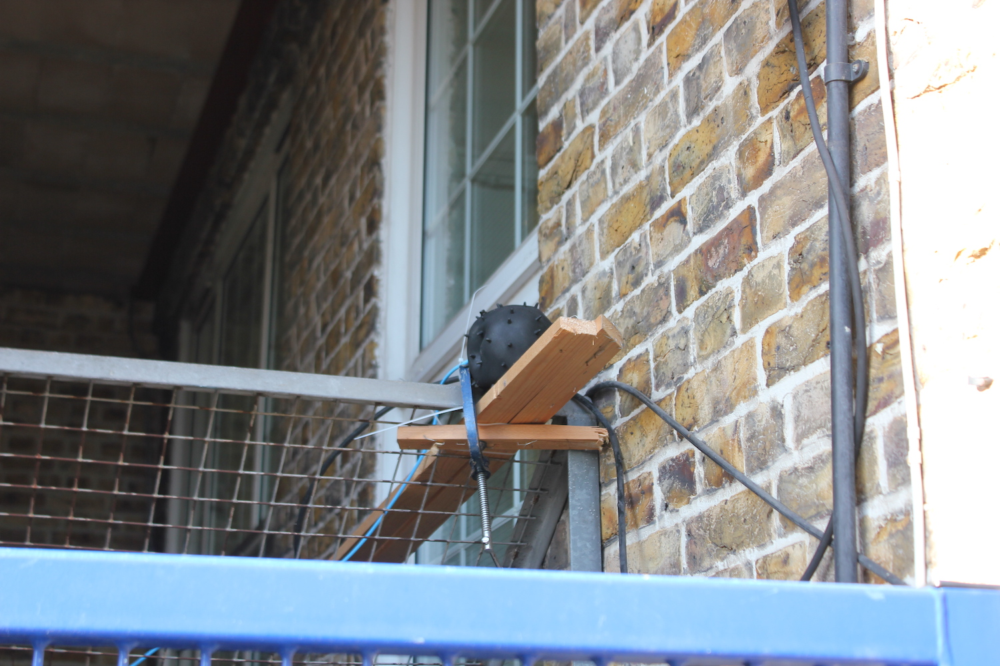  
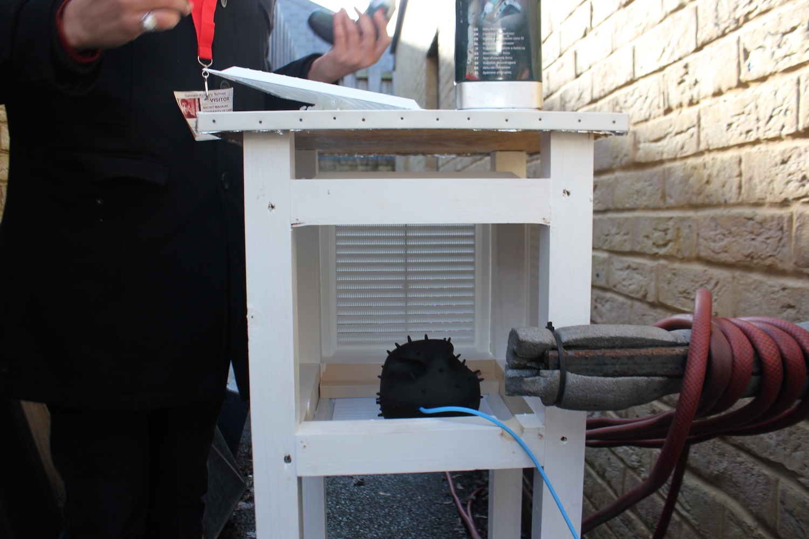  
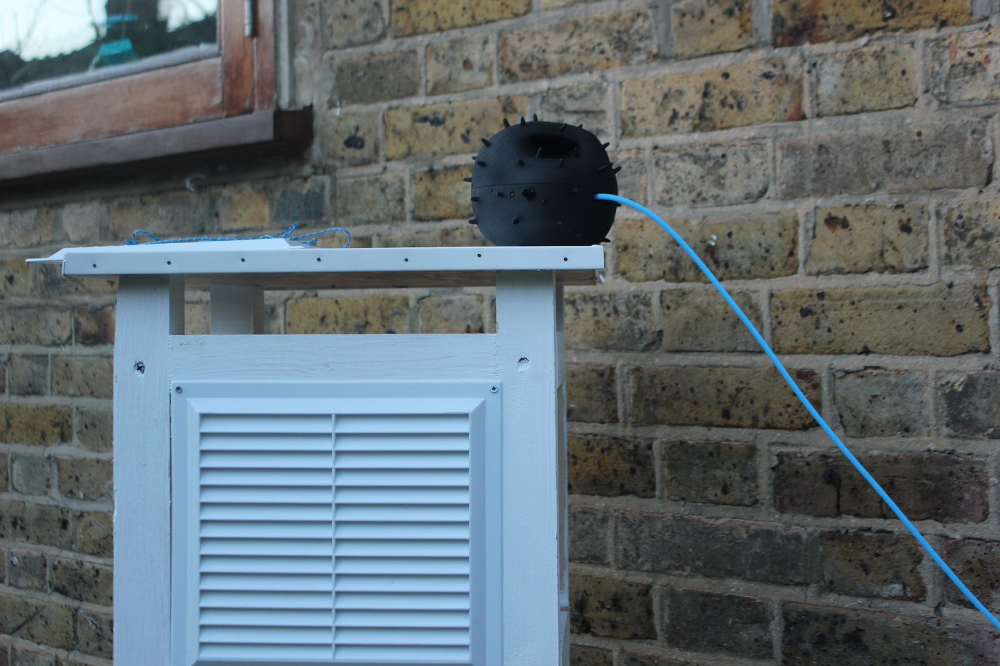  
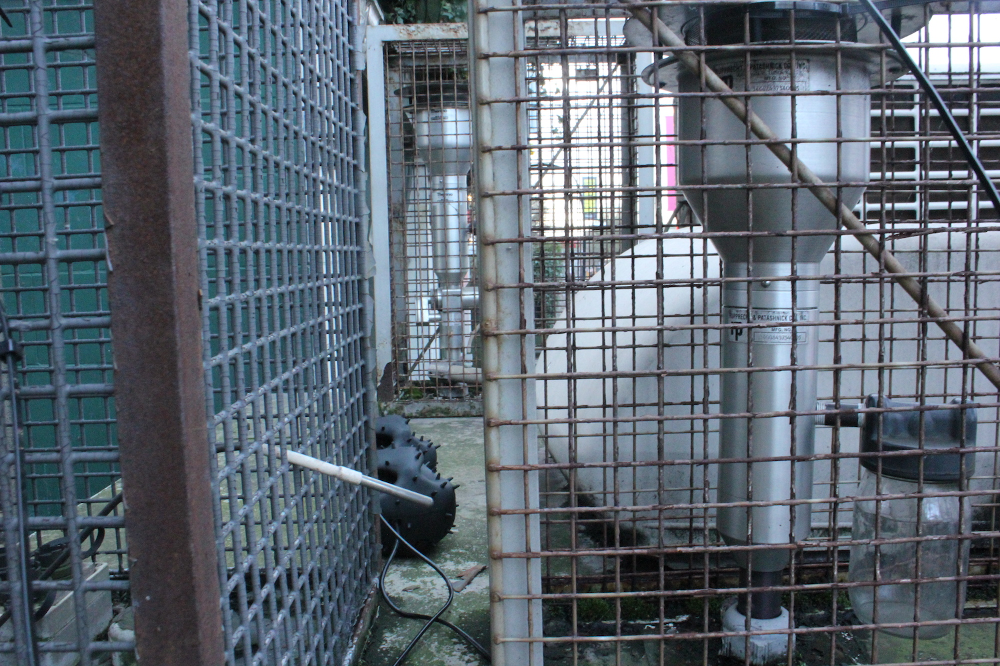  
   Different Dustbox 2.0 installation setups
 

### 4.4. Connecting your Dustbox 2.0 to a Wi-Fi network

The first time you turn on your Dustbox 2.0 you will need to connect it to a Wi-Fi network so that it can stream data to the Airsift platform. You do not need an app for this. The Dustbox 2.0 automatically creates a local network where you will input your Wi-Fi details (SSID and password).

1.	Plug in your Dustbox 2.0 to the power socket. Once it is powered on it will start to flash. This indicates that the device is attempting to connect to a Wi-Fi network.
2.	When the device is not able to connect to a network, the speed of the flashing LED increases. This means that it is creating a local network.
3.	On your phone or laptop, navigate to the list of available Wi-Fi networks. Look for the network ‘dustboxXXXX’. The ‘XXXX’ will be the number given on the PCB inside your Dustbox 2.0 device. For instance, the network might be labelled ‘dustbox0021’.  
4.	Connect to this local dustboxXXXX network by selecting it on your phone or laptop.
5.	A different password is required to access the network on each Dustbox 2.0. This will be included in the materials sent to you or defined in the source code that you edited.
6. After a few seconds, a webpage will open. You should select the option to ‘Configure Wi-Fi’ from this page.

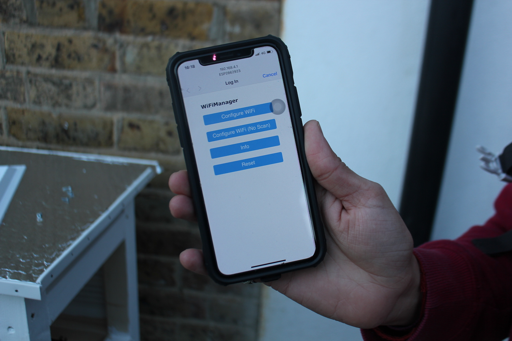
  Connecting the Dustbox to Wi-Fi
</p?

7.	Once you have selected, ‘Configure Wi-Fi,’ you will then need to click on the name of your Wi-Fi network (or SSID) that you wish to connect to from the list of available networks. This will autofill the SSID box below with the network name.
8.	Check that your network details are correct, type in your password and click connect. The connection can take a few minutes to establish. 
9. Once a connection is established, the clear LED on the Dustbox 2.0 will change from flashing to continuous. Once the LED has stopped flashing, you can close the Wi-Fi configuration window on your phone or laptop. 
10.	Once data is sending, the LED will shut down. Your Dustbox 2.0 will now be sensing and sending data!
11. The local ESP network will automatically disappear if you turn off the power to your Dustbox 2.0. Your Dustbox 2.0 will automatically re-connect to your Wi-Fi network once the Dustbox 2.0 is turned back on. 
12. If you need to update your Wi-Fi connection because your Wi-Fi details change, you will need to re-configure your Dustbox 2.0 by repeating steps 1 to 7 above.
13. The particulate matter, temperature and humidity data from your device will be sent to our database. You should now be able to view your data in [Airsift](https://airsift.citizensense.net/). Click on 'Dustboxes' and search for your Dustbox. You may need to wait a few minutes for your first readings to come through.

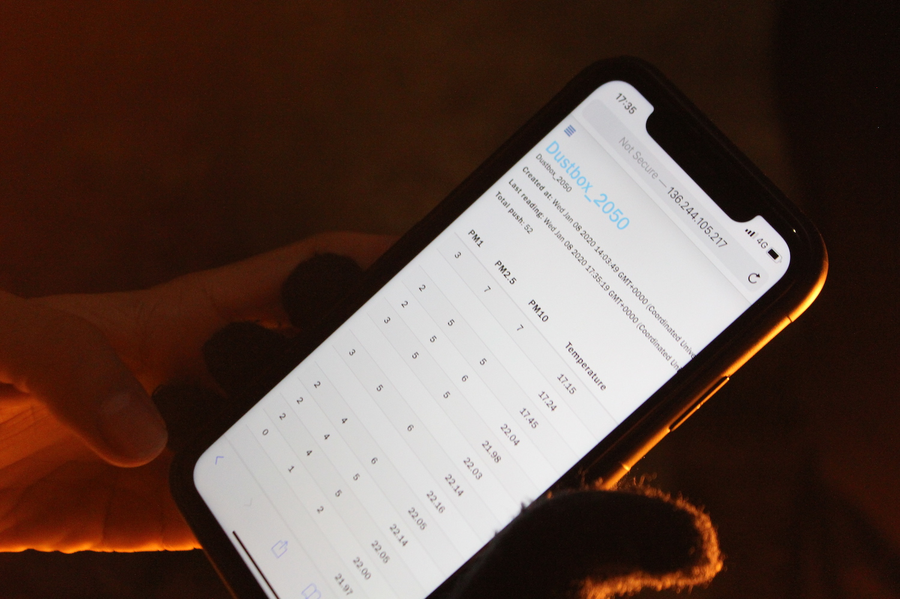  
  Viewing the Dustbox data on the server via Streams

14. You can analyze your data in our DIY data analysis tool, [Airsift](https://airsift.citizensense.net/). This tool allows you to select the date range, data mean (e.g., hourly data), and to compare your data to other monitoring sites, including LAQN sites. You can also download your data as image files (.png) or data files (.csv) from the Airsift tool.
15. For an example of how plots and graphs from the Airsift tool can be put together into ‘Data Stories’, see our [Deptford Data Stories](https://citizensense.net/data-stories-deptford/). Find more details and instructions for creating your own data story in [Section 5.6](https://github.com/citizensense/Airkit/blob/master/toolkit.md#56-airsift-data-stories).

Note: In case the Dustbox does not respond or the LED doesn't switch off, just press the reset button once and wait for it to reconnect. Once reconnected the LED will stop flashing.

If you are having problems connecting to your Wi-Fi network, please see [Appendix 1](https://github.com/citizensense/Airkit/blob/master/toolkit.md#connecting-the-dustbox-20-to-wifi) for Troubleshooting and FAQs.

###  4.5. Safety and care

The AirKit toolkit should be relatively straightforward to use, and the Dustbox 2.0 should be easy to plug in and begin monitoring your air quality. However, it is important to follow common-sense precautions when setting up and using the Dustbox 2.0, and when monitoring air pollution more generally. Please follow this guidance when using your Dustbox 2.0:
* If you have placed the Dustbox 2.0 in an area of expected elevated pollution, be sure to minimise prolonged exposure by spending only short periods of time near the monitoring area.
* Make sure that the sensor is not mounted near any vents, cooking areas, humidifiers or boiler outlets as this could affect the sensor readings. 
* If you place the Dustbox 2.0 close to a roadside, take precautions and set the device back from the road to minimise risk from traffic. Do not walk along the road while using monitoring kit or while looking at the website collecting data from the device. 
* When installing your Dustbox, be sure to secure any ground-level cables to minimise trip hazards. Regularly inspect the Dustbox 2.0 to ensure that it has not been damaged and there are no obvious defects.
* Only plug the Dustbox 2.0 in or out when it is dry outdoors, and avoid exposing the electronics to water.
* In the event that dust or bugs get lodged in your sensors, you can power off the device, open the case at the centre and clean it by spraying the sensor opening with canned air. 
* While you will need to open up the device for cleaning, you should avoid dismantling the electronics as this could present a risk of shock and could interfere with the measurement functioning of the device.
* Ensure the Dustbox 2.0 is maintained and in a good state of repair before setup and during use.
* Please note that if you borrow a Dustbox 2.0 from us, you agree to take care of your kit and return it to us when requested. 
If you are concerned about any changes in the equipment or have any questions about how to maintain it, please contact [info@citizensense.net](mailto:info@citizensense.net). Be sure to review our [Terms of Use](https://citizensense.net/about/terms/) for full guidance. Citizen Sense does not accept liability for the faulty construction, installation or use of any components of the Airkit or Dustbox 2.0, or for the interpretation of data from the toolkit.
    

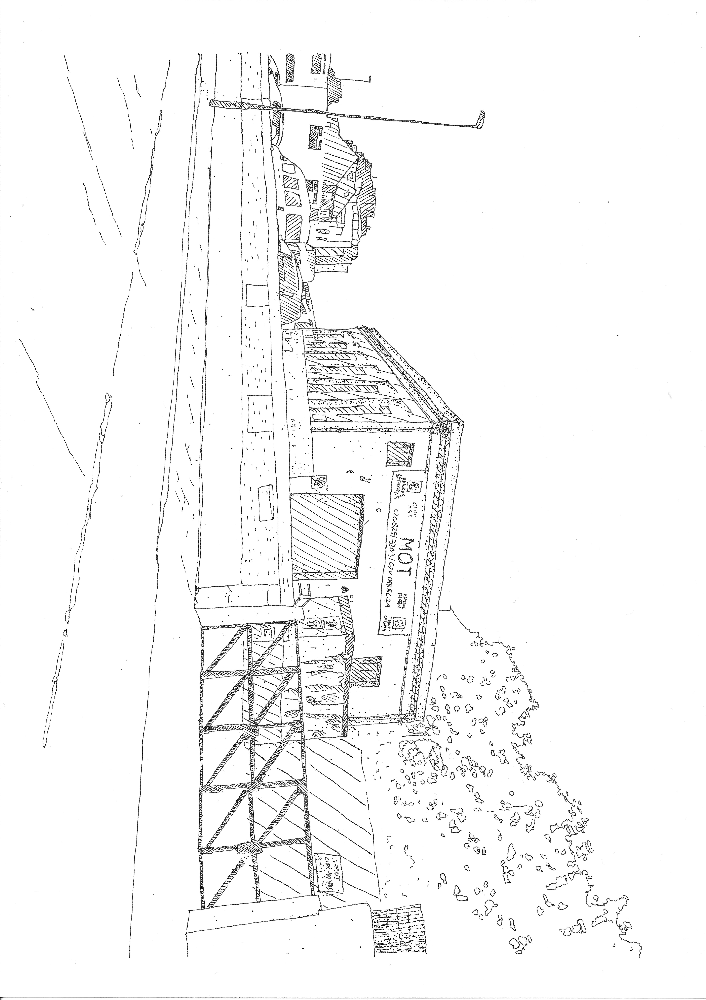 
  View of the MOT Centre
 

    
## 5. Data Analysis and Data Stories

Once you have set up the Dustbox 2.0 and begin collecting data, you might want to analyze patterns in the data to understand when and where pollution is occurring. We have created a DIY data analysis toolkit, [Airsift](https://airsift.citizensense.net/), as a web-based platform that you can use to explore and analyze Dustbox 2.0 data and compare it to other sensors.

To understand pollution trends and seasonality, it is recommended to collect data for at least one month. However, with additional data you will be able to observe pollution trends in more detail, and establish patterns and identify possible pollution sources.

This section describes how to use Airsift, including how to view and analyze data, record observations and write data stories.

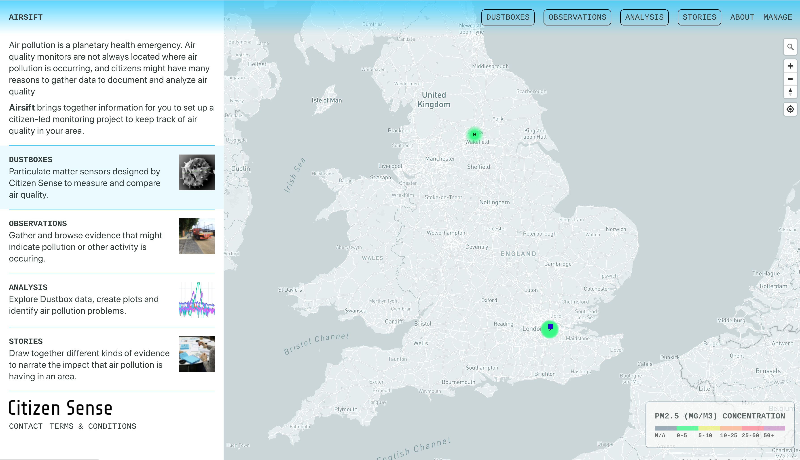 

### 5.1. Airsift DIY data analysis overview

Airsift includes different charts and interactive features that allow you to visualize data in real-time and look back at historic sensor data. You can also add different data through the Observations Tool. Observations could include information about your local area including smells, noise, visible pollution, activity or changes in the environment, as well as health effects and media reports. In addition to the Observations Tool, there is a Data Stories Tool for assembling naratives about pollution issues in your local community.

As outlined in previous sections, air pollution is associated with urgent planetary health concerns. When collecting and analysing these data it is important to keep in mind the ethics of gathering air quality data. If you send data to the Airsift platform and consent to it being shared, it will be publicly viewable. Other contributors may use your data in their stories to understand their local air pollution. The AirKit toolkit is designed to help you produce the most accurate air quality data possible, however, it can not be assumed that the data is correct at all times. When you work with data on Airsift you agree to our [Terms of Use](https://citizensense.net/about/terms/).

### 5.2. Airsift sign-up

While you can view all Dustbox data on the platform without signing up, to add stories and observations to the site, you need to create an account. In your web browser navigate to the [Airsift](https://airsift.citizensense.net) site. In the top right of the site, you will notice a 'Sign In' button. Here you can sign in if you have an existing account or you can create a new Airsift account. When you create an account, you will need to provide an email address, select a username and display name that will be displayed publicly with your contributions. After selecting these options, please read the [Terms of Use](https://citizensense.net/about/terms/) and select a password.

### 5.3. Airsift map

When you arrive on the Airsift page, you will notice a left-hand sidebar that will guide you in navigating the different areas of the site, including Dustboxes, Observations, Analysis, and Stories. On the right, you will notice a map with values in coloured circles. You can navigate the map by clicking and dragging it, and zoom in and out using your mouse/trackpad. It is also possible to search for a location or use your current location to re-locate the map in the top right-hand corner of the site. 

If you select 'Dustboxes' from the navigation pane, it will provide a list of Dustboxes. Each Dustbox is represented by a circle. The colour of the circle corresponds to the legend in the bottom right-hand corner of the map. If the PM2.5 concentrations are low (less than 5 ug/m3) the circle will be green, if they are very high (over 50 ug/m3) the circle will be purple. This value is determined by the latest hourly average of the sensor and is displayed as text inside the circle.

If you hover over a circle, it will bring up a pop-up window that displays further details about the Dustbox, including its number/name, location, the most recent hourly reading and date. Clicking on the Dustbox will give further detail including a line graph of latest data and a button to 'Analyse Data' further.  

### 5.4. Airsift Analysis

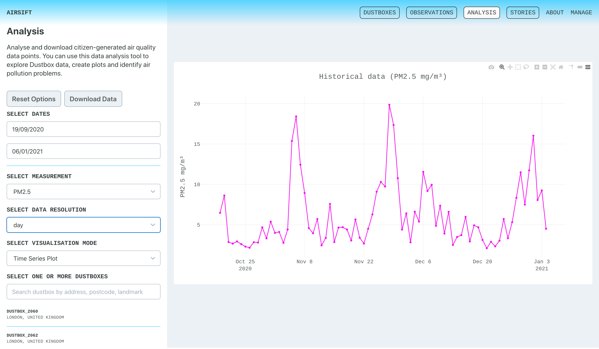 

Airsift offers an air quality analysis application to produce a range of charts and graphs that allow you to interpret citizen sensing data. This feature can be accessed through the navigating to Analysis on the top right navigation bar. You can also access these analysis options through selecting a Dustbox on the map and selecting 'Analyse Data'. 

On the 'Analysis' page, plotting options can be selected using the interface on the left hand side. First select the date range that you wish to analyse and then select a measurement (PM, Temperature, Humidity). Next, select the temporal resolution of data you wish to analyse (minute, hour, day, week, month, year). There are currently two visualisation modes: time series plot and pattern plot. You can then select Dustboxes by searching for their name or location. 

Different visualisation modes represent the data in different ways. Here is a brief description about the different charts and what they allow you to interpret:
   * Times Series Plot: Allows you to visualize data as a relationship of pollution levels over time. You can also compare pollution levels at two sites by selecting more than one monitor.
   * Pattern Plot: Allows you to plot different resolutions of time against particulates and view pollution patterns in relation to time of day, day of week, and month.

###  Detailed instructions for using the Analysis functions include:

* To view Dustbox 2.0 data or to plot graphs for the data, navigate to the Analysis page. 
* Select the dates that you wish to analyse.
* Then choose the measurement that you wish to analyse (i.e. PM1, PM2.5, PM10, temperature or humidity).
* Set the data resolution. One-hour data can be useful for understanding pollution patterns in finer details. Twenty-four data can allow you to see broader trends and is helpful for analyzing larger datasets with longer date ranges. 
* Select the type of graph that you want to generate through visualisation mode.
* Select the Dustboxes you wish to analyse by searching for the location that you wish to analyse or a specific Dustbox name. This will generate a list of nearby Dustbox streams that you can select from. You can select more than one Dustbox.
* Graphs will be generated automatically on the right hand side of the screen as you change these settings.
* You can download the data or reset your options.

While observing the data, it is advisable to look for sudden peaks (also known as inflection points). Some of these peaks can relate to 'air pollution incidents' such as a fire, traffic congestion, or construction activity. In such a case, you might notice that the data shows a sudden spike and over time it returns to a lower level. In some cases, you might observe a sudden peak (one data point) and then a return to lower levels This is a typical example of an outlier. Outliers are the data instances that deviate from the rest of the data patterns. Such an incident might occur if you move the Dustbox 2.0, or if there is a blocked air inlet or a faulty sensor. If you notice regular outliers in your data, be sure to check your Dustbox 2.0 to make sure there are no faults with the device.

### 5.5. Airsift Observations

In addition to Dustbox data that you can analyze through Airsift, local observations can be used to identify when you and your community sense pollution. These data can reveal possible sources of pollution in your local community. Observations can help you to explain spikes or anomalies in the data produced by Dustboxes and understand local spikes and trends. You can use Airsift to map observations about your local area. Observations might include things that you smell (burning), hear (traffic noise), see (smog, development activity) or feel (health effects). They can also include news about related to pollution, including warnings of high levels of pollution or reports about fires.
* You can view a list of existing observations and add observations by navigating to 'Observations'. Please note, you need to be signed in to create an observation.
* Choose a title for your observation. Make your title clear and descriptive.
* Under 'Body' add a short description of your observation.
* If your observation is associated with a particular Dustbox, then you can select this from the drop-down menu.
* Add the date and time of your observation, this will default to the current date and time.
* Select the type of observation you are generating (i.e. smell, visible pollution etc.).
* Select the location of your observation using the map. Navigate to the site of your observation and click its location on the map. If your observation is a media report, locate this somewhere that is useful and easy to find in relation to the reported pollution activities or events.
* You can choose to add an image to your observation.
* You can now preview your observation or submit it for moderation.
* Once you publish your observation it will be plotted and viewable to others on the Airsift map as a small blue square.

### 5.6. Airsift Data Stories
Data Stories draw together different kinds of evidence to narrate the impact that air pollution is having in your area. You can group together multiple forms of evidence that might include citizen data, regulatory data, weather data, local observations and other kinds of visual and auditory media. If you have followed these Logbook instructions for setting up a monitoring study, you will have established the questions that you want to ask about local pollution sources. Using these different types of data, you can identify possible sources of pollution and develop actions for improving local air quality. This section gives instructions for how you can write a Data Story using data from your monitoring and publish it on Airsift. 

To add a Data Story to Airsift, select 'Stories' in the navigation window and then 'Add a Data Story'. This will take you to a page which will guide you through the process of generating a Data Story. This includes generating an introduction and describing the monitoring location to outlining community actions.

#### 5.6.1. Writing Your Data Story 

Writing a Data Story is a detailed and collaborative process that will likely require several iterations and revisions. The instructions below can act as a guideline to help you structure and complete a Data Story based on citizen data. You can see this structure in action by browsing published [Data Stories](https://citizensense.net/data-stories-deptford/). It can be helpful to include images of your local area in the data story to illustrate the landscape, highlight visible pollution and activity, or demonstrate how and where sensors are installed.  

##### Summary
At the start of the data story, it is useful to give a summary of the key findings and the data used in your Data Story. This section should be short at around 1–2 paragraphs.

##### (1) The Location
In the early stages of your project, you will have considered the local area and possible pollution sources. Begin this section by offering some context and background on the area that you are monitoring. Here you should note how the land is currently being used and any future changes in this. Describe the different types of activities in the area, including availability of green space or presence of industry.

**Local sources of particle pollution**
Outline the key sources of pollution in your area. Here you might focus a paragraph on transport, waste, industry as appropriate for the area. Consider the ways in which sources might be impacting local air quality and what the specific sources are.  

In a separate paragraph, note where Dustboxes are located. Give some context as to where the monitors are. Are they indoors or outdoors? Are they close to the road or tucked away in a back garden? You should also note and include other citizen and regulatory monitors that provide data for this area. 

It is useful to produce a satellite map ([Mapbox](https://www.mapbox.com/maps/satellite)) that identifies the approximate location of Dustboxes that are being used in the data story and possible pollution sources. Before including devices on the map, make sure that you have permission to identify them. It is preferable to use fuzzy locations, with Dustbox circles located within a wider area rather than pinpointed to a specific location. 

Identify possible pollution sources including but not limited to:
  * Construction and development sites.
  * Waste treatment plants and refuse and recycling centres.
  * Main roads and points of traffic congestion.
  * Transport infrastructure such as train stations.
  * Power stations, oil refineries and mining.
  * Sites of agricultural activity.
  * Sites of potential burning activity such as allotments.
  * Factories and other industrial activity.
  * Biogenic or geological sources of pollution (such as volcanoes, deserts, wildfires).

**Regional and global sources of particulate pollution**
In this section, describe regional pollution sources for your area. Regional sources can be identified by looking at local pollution reporting mechanisms. For instance, industry or wildfire might cause air pollution that travels several hundred kilometres to cause pollution events in your area. If the monitoring area is urban you would expect local sources to be related to transport. In a rural location particulate matter might be related to agricultural sources. 

**Observations**
In this section, note any key observations from the monitoring period (and before). Observations can be used to help you understand some context behind the Dustbox data. The time and location of these events are important factors to note as they can help you identify possible sources of pollution. You can map observations on the Airsift platform and view the observations from other contributors. It is also useful to meet as a group and discuss your shared observations as other observations and experiences may become apparent. 

Observations might include unpleasant smells, sources of noise and visible sources of pollution such as smog, smoke and dust. It could also relate to visible activity such as construction work. Some residents might note the health effects of pollution. You could find news reports of fires, pollution warnings and other media that can help explain peaks in the data.

##### (2) Is There Evidence of a Problem
This section can be adapted from existing story text to fit the context of your monitoring study. This could include a note that explains that the Dustbox 2.0 device is an 'indicative' (or non-regulatory) monitor. Here you should note any co-location activity of the monitors (before, after or ideally both) and the findings of this. Note that while the World Health Organisation has established guidelines for PM2.5, there is no safe level of exposure. 

To establish whether there is evidence of elevated pollution in your area, you can follow these steps:
  * Create a **line plot** for each Dustbox in your area for the monitoring period. 
  * Review the peaks and baseline of the data. 
  * Are the World Health Organisation or local air-quality guidelines regularly breached? 
  * Is there any other data/information from your local authority or other monitoring projects that support this finding? 
  * You can also compare the data you have collected to other monitors for this period. 
  * If there are ambient monitors (those away from the roadside), you can compare and see if peaks are caused by local or regional sources of pollution. 
  * If pollution is local you will see a spike in your monitor where the ambient monitor is flat. If it is regional you will see similar peaks and troughs in both monitors.

##### (3) Characterizing The Problem
In this section you can use Airsift to identify the times of day and weather conditions where PM2.5 concentrations are most prevalent. Using a combination on analysis methods will allow you to identify likely sources of particulates. It is important to include images of plots of charts here to illustrate your analysis. Plots can be downloaded or copied from the Analysis tool in Airsift. *Note that some plots and graphs listed here might not be available on Airsift in its different stages of development.*

**When is the source most evident**
**Time plots** can be used to analyze the times when pollution levels are most frequently elevated. Time plots aggregate PM2.5 concentrations according to time to indicate: 
* Key patterns such as rush hours and traffic. 
* Possible construction or industry sources. 
* Regional pollution events due to seasonal variation

Create a plot for each of the Dustboxes in your monitoring study. Look for peaks across weekdays and weekends. If traffic is a source of pollution, you would expect to see peaks at times of increased congestion i.e. the morning and evening rush hour. 

When you look at each plot consider how the Dustbox installation could impact the data. Dustboxes that are close to the roadside will often see higher peaks at rush hour. Those in the garden might show peaks at different times, for example barbecues on Sunday afternoons.

**Which direction is PM2.5 coming from?**
**Scatter Plots of PM2.5 Concentrations and Wind Direction** can be used to gauge the location of emissions sources in relation to the Dustbox monitors. Particulate matter is carried by the wind from emissions sources to the monitoring area. Wind direction is given in degrees where 0 (o) is North and 180 (o) is South. Note the directions where the highest levels of pollution are recorded. 

**Polar plots** can also illustrate this relationship. Colour contours reflect pollutant concentrations in relation to wind direction and wind speed. Calm conditions (zero wind) are shown in the centre, increasing up to 20 metres per second (ms-1) at the outer ring. The highest mean concentrations are shown in red, the lowest are in blue, in a dynamic scale. 

* Look for patterns in the polar plots, are they similar across the different monitors? 
* Where are the highest levels of pollutants coming from? 
* Look at the satellite map and see if you can see any possible sources of these emissions. 

**Under which weather conditions are PM2.5 levels most evident?**
**Scatter Plots of PM2.5 Concentrations and Wind Speed** can be used to understand the relationship between wind speed and PM2.5 to identify if elevated levels are present at low winds, thereby indicating possible local emission source(s).

**Scatter Plots of PM2.5 Concentrations and Temperature** can be used to check if there is a positive or negative correlation between temperature and PM2.5. This can help in understanding the seasonal variation of PM2.5 with respect to temperature.

**Scatter Plots of PM2.5 Concentrations and Humidity** can be used to illustrate the relationship between PM2.5 and humidity. During high humidity, there would be fewer occurrences of wind-blown dust.

##### (4) Drawing The Evidence Together
This section brings together a bullet point list that summarises all the evidence presented throughout the previous sections.
* Summarise the sources of data that have been used in the study. 
* Draw out the key findings of your analysis and observations to identify key sources of pollution. 
* You may wish to note whether sources were mostly regional or local and where the pollution might be coming from. 

##### (5) Actions
Actions are recommendations for things that can be done to improve local air-quality and to mitigate the effects of pollution. The process of developing actions should be in dialogue with your community and through engagement with local government and planning officers about infrastructure, development and industry. Consider what the main sources of pollution are and what kinds of actions would help improve air quality. It is likely that actions relating to a combination of these would improve your local air quality. This could be related to: traffic and transport; construction and development; green infrastructure; air quality monitoring; waste management; industry and/or agriculture.  
 
For each source of pollution or intervention, investigate local policy and planning. Here you should consider ways in which existing policies or plans could be extended to improve air quality. For example: 
* The local council may have plans to improve cycling infrastructure. The findings of your data story might highlight the need to extend this to a wider area. 
* Your monitoring might identify an area where a green screen could notably improve air quality at a key community site.
* Your study might determine a potential source of pollution that requires further and more focussed monitoring.

##### Data Story Acknowledgments
In this space you can thank and acknowledge the contributions that different people or organisations have made to your Data Story and wider monitoring study. 
* You may want to thank citizens, groups and initiatives that have helped. 
* You may have received some financial or technical support with establishing the monitoring study. 
* Ensure that you have permission to name any collaborator on your project.

#### 5.6.2. Publishing Your Data Story 
Once you have finished writing your data story, you can publish it on the Airsift platform through the following steps:
* To create a data story first select 'Create Story' in the navigation bar at the top of the Airsift site.
* Select a title for your story, keeping it simple, short and descriptive.
* Use the text-box to create an outline for your Data Story, following the above instructions. 
* Using the tool-bar you can add simple formatting to text (i.e. bold, italics etc.), add links to other media, and insert images and tables.
* You can upload images from your computer or copy and paste plots from Analysis. 
* Follow the structure outlined in the text box to complete your data story.
* Some instructions for producing your Data Story are given in the right-hand-side of this page.
* You can view and read examples of published data stories at [Deptford Data Stories](https://citizensense.net/data-stories-deptford/) and [AirKit Data Stories](datastories-airkit.citizensense.net/)

 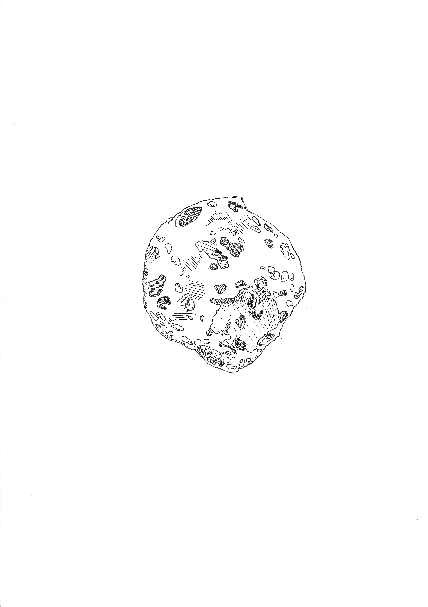
  A diesel char molecule

## 6. Summary and Acknowledgments

This logbook has discussed the process of establishing a citizen sensing study. It takes you through the process of identifying air quality concerns, building a Dustbox 2.0, setting up a Dustbox and collecting data, as well as interpreting data and developing data stories to communicate your findings to multiple publics and stakeholders. 

We are interested to hear about air quality campaigns and how you are using or planning to use the AirKit to collect and analyze data. We are also interested in receiving  feedback or comments you have related to the AirKit. If you would like further information on any aspect of AirKit, please contact us on [info@citizensense.net](mailto:info@citizensense.net).

The Citizen Sense and AirKit projects are led by Professor Jennifer Gabrys. AirKit has been developed working in collaboration with [Dr Sachit Mahajan](https://planetarypraxis.org/people/sachit-mahajan) and [Dr Joanne Armitage](https://planetarypraxis.org/people/joanne-armitage). Thanks are due to our additional collaborators including:

[Common Knowledge](https://commonknowledge.coop/) contributed to the development of the Airsift platform. Lau Thiam Kok and Tassos Noulas contributed to the data architecture of the Airsift platform. 

The Citizen Sense Dustbox 2.0 included collaborative contributions to the materials design and 3D printing by Andrea Rinaldi, who built on an earlier Citizen Sense Dustbox 1.0 designs developed in collaboration with [Francesca Perona](http://www.francescaperona.com/) and [Helen Pritchard](https://citizensense.net/about/people/helen-pritchard/).

Special thanks are due to the participants and residents in the Forest Hill area of London who contributed to the development and testing of AirKit and the Dustbox 2.0, as well as to the collection and analysis of data and communication of results to wider publics and regulators. For more information on project contributors, see Citizen Sense [People](http://citizensense.net/about/people/).

The research leading to these results has received funding from the European Research Council under the European Union’s Seventh Framework Programme (FP/2007-2013) / ERC Grant Agreement [n. 313347](https://cordis.europa.eu/project/id/313347), “Citizen Sensing and Environmental Practice: Assessing Participatory Engagements with Environments through Sensor Technologies,” and from the European Research Council under the European Union’s Horizon 2020 research and innovation programme (ERC Grant Agreement [n. 779921](https://cordis.europa.eu/project/id/779921)), “AirKit: Citizen Sense Air Monitoring Kit.” Further funding was received through an ESRC Impact Acceleration Account from the University of Cambridge (2020).

AirKit is available to use under a [CC BY-NC-SA](https://creativecommons.org/licenses/by-nc-sa/4.0/) license. You are free to use, adapt, and share this toolkit for non-commercial purposes under the same CC BY-NC-SA license, and with attribution to Citizen Sense. 

__________________________________________________________________________

# Appendix 1: Troubleshooting and FAQ

### Connecting the Dustbox 2.0 to Wi-Fi
1. I am having problems connecting to the Wi-Fi
The Dustbox 2.0 requires a secure and stable connection to send data.
* By secure we mean WPA2: most routers use this encryption.
* By stable we mean that the Wi-Fi network does not lose the connection frequently.
You need to know the Wi-Fi network name (SSID) and password (if required).
* For example, it is possible for the device to connect to your home Wi-Fi router or a mobile phone hotspot.
Some Wi-Fi networks have firewalls that block devices connecting to the Internet. If this is the case you will need to:
* Add the MAC address of the device to the allowed devices on your router.
* Add [citizensense.co.uk](citizensense.co.uk) to your trusted websites list.
* If the Wi-Fi network requires you to log in with your email or other information, then you will not be able to set up the Dustbox 2.0 on your network.

2. I don't see the dustboxXXXX Access Point
* The dustboxXXXX access point only appears if the device is switched on and is not already connected to a network.
* If you don't see the network appear, make sure that the device is switched on and the clear LED is flashing.
* If the device is switched on and not flashing it means that it is already connected to a network.
* Some computers, often those in institutions, are connected to the Internet via an Ethernet cable. This means that they might not be able to connect to Wi-Fi networks. If this is the case, use your phone or another Wi-Fi enabled device to establish a connection.

3. I can see the dustboxXXXX Access Point but the window for entering details does not appear
When you connect to the dustboxXXXX Access Point you should be re-directed to a page where you can enter your Wi-Fi details. There are a few different ways to try and trigger this screen if it does not pop up. It can take a bit of time for the captive page to load. If you are waiting longer than a minute or so, try the following:
* Navigate to your device's browser and type in any URL beginning with "https://". This can sometimes trigger the captive portal.
* Restart your device and reconnect it to the network.
* Clear your device's history and cookies and reconnect to the network.
* Try a different device: this issue can appear less frequently with laptops or desktop computers.

4. What if I change my Wi-Fi network?
If you change your Wi-Fi network, you need to switch off the Dustbox 2.0 and follow the connecting instructions in [Section 3](https://github.com/citizensense/Airkit/blob/master/toolkit.md#3-building-a-dustbox-20) to set up your new Wi-Fi details.

5. What if power is lost?
If your device loses power if will no longer collect and send data. You will need to reconnect to a power source, when switched off the device should automatically reconnect to the Wi-Fi network.

### Using the Dustbox 2.0

1. How do I get hold of a Dustbox 2.0? 
You can borrow a Dustbox 2.0 from Citizen Sense by contacting [info@citizensense.net](mailto:info@citizensense.net). It is also possible to build your own Dustbox 2.0 following the instructions outlined in [Section 3](https://github.com/citizensense/Airkit/blob/master/toolkit.md#3-building-a-dustbox-20) of this toolkit. 

2. What if I want to change the design?  
Dustbox 2.0 is an open-source device so you can modify the existing circuit design, code and enclosure to customize it. We are keen to hear about any edits you make to the design so please get in touch.

### Dustbox 2.0 in the Field

1. Can I set up the Dustbox 2.0 indoors?
It is possible to setup the Dustbox 2.0 indoors, but indoor activity such as lighting candles, hoovering and cooking can impact readings. Be sure to consider differences in indoor and outdoor pollution sources when composing your Data Story and proposing actions.

2. My sensor is not producing particulate matter data as expected. 
You can test that your sensor is performing as expected by hoovering or lighting a match near to it. If you do not see peaks in the data when you do this, it is possible that the connection between the particulate matter sensor and board has become loose. If you see lots of ‘_ ' or ‘0' in the data it could be that the sensor has disconnected.
You can test that the particulate matter sensor is powered by listening for the fan. If you are not able to hear the fan, reset the device and make sure the LED flashes. If you can hear the fan is switching on, ensure that the small holes in the side of the 3D-enclosure are not obstructed. Turn the sensor off and spray some canned air in to remove any bugs or debris.

If this doesn’t solve the issue, you can check that the connection between your sensor and the microcontroller is secure by doing the following: 

* Turn the sensor off at the mains.
* Take the lid off your sensor by twisting the top half anti-clockwise.
* Inside you will notice a PCB with some other sensors and components connected.
* There is a red and black cable that connects the particulate matter sensor to the PCB.
* Inspect the cable and make sure that it does not look damaged.
* Check that the connection between the cable and the board is secure by pushing the sensor in to place.
* Put the lid back on the device and switch the mains power on.

The other end of the red and black cable is connected to a particulate matter sensor housed underneath the PCB. To check this connection you need to take the sensor apart following the steps below.

* Turn the sensor off at the mains.
* Take the lid off your sensor by twisting the top half anti-clockwise.
* Remove the cables connecting the button and the LED to the PCB.
* Remove the red and black cable that is connected to the PCB.
* Gently remove the USB cable from the socket, supporting the connection with your hands.
* Unclip the PCB from the cradle and gently lift it up. 
* Underneath you should see a blue sensor clipped in to another cradle.
* Locate the end of the red and black cable and ensure that it is securely connected to the sensor body. You might need to unclip the sensor to do this. 
* If you remove the sensor: inspect the bottom of the 3D-enclosure and locate the rectangular hole (USB hole). Loop the other end of the black and red cable through the frame and up the side of the enclosure. Place the PMS5003 sensor into the cradle at the bottom of the enclosure ensuring that the fan is lined up with the air vents at the other side. Make sure that the sensor sits flat and clips into place.
* Once the sensor is in place, connect the other end of the red and black cable to the connector on the PCB. Make sure that the cable is flat. These connectors can be a little stiff.
* The PCB rests in the upper frame and is secured using the clips either side. Clip the PCB into place ensuring that the PCB header pins for the button and LED are next to the corresponding holes in the enclosure. The USB connector should line up with the USB hole. Make sure that the PCB sits flat and is fully clipped in to place.
* On the PCB, locate the two header pins labelled 'BTN'. Attach the '+' button of the button to the '+' on the board. This will be covered by the clip that holds the PCB into place). Attach the socket connected to the long leg of the button to the adjacent header pin.
* Attach the (slightly) longer leg of the LED to the header pin labelled "+" and the short leg to the neighbouring header pin.
* Insert the USB cable through the USB hole. It can be a little stiff to connect to the USB socket so place your finger at the back of the USB breakout board to support while you push the cable in. It might look like the cable is not fully connected but the overhang is around 2 mm.
* Turn the device on and ensure that it reconnects to your network. 

3. How much does it cost to run my Dustbox 2.0? 
The cost of running the Dustbox 2.0 will depend on your energy supplier, but it is a very low-power device. To leave it on at all times will consume around 0.027 kWh.

### Analyzing Data
1. There are some unexplainable peaks in my data.
You might notice some peaks in your data outside of expected hours. These could be caused by having the device close to a boiler outlet. It could also be caused by an insect or some dirt being trapped in your sensors. If you suspect this may be the case, turn off your sensor and spray it with canned air.

2. I'm looking at my stream and there is a " " or blank in my readings.
Occasionally the device won't collect a reading for a minute or so this can be caused by something like the power or Wi-Fi disconnecting momentarily. It's ok for the occasional reading to drop, if 90% of readings are present in a time period the sensor is performing within normal ranges.

### Privacy

1. I want to my data to be private.
When you create sign up for Airsift you can select privacy options on your data, including whether it is publicly viewable and whether you want to be named as the author of your data (or listed as anonymous). These settings can be changed through your profile page. However, once data that you have produced is used in a data story, it will be published and can no longer be made anonymous or private. These same conditions apply to observations.

# Appendix 2: Building a Stevenson Screen

The Dustbox comes with waterproof housing and a removable bolt that can be connected to a shelf or other surface. In some situations it can be useful to have something to put your Dustbox in if you do not have access to sheltered outdoor space. Stevenson screens are shelters that can house sensors protecting them from the elements and allowing air to circulate. Professional Stevenson screens can be expensive to purchase but you can make your own using wood and air vents using the instructions below. A bit of wood-working experience and another pair of hands can really help with this process.

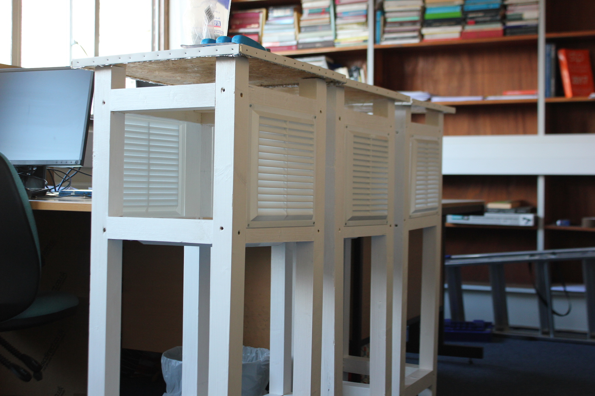  
  Three Stevenson screens waiting to be deployed
 

 
### Tools and equipment that you will need:

* Workbench 
* Goggles
* Hand saw or electric table saw
* Ruler and pencil
* Drill w/ bit just smaller than widest screw
* Screw driver (preferably electric)
* Spirit level (optional)
* Clamp (optional)
* Hammer
* Wood file
* Tape measure

### Materials 

* < 250ml white paint suitable for outdoor use (we used [this](https://www.wickes.co.uk/Dulux-Weathershield-Exterior-Multi-Surface-Quick-Dry-Satin-Paint---Pure-Brilliant-White-750ml/p/149419?utm_source=Website&utm_medium=email&utm_campaign=confirmation))
* 6 x louvre vents (we used [these](https://www.toolstation.com/louvre-vent-flyscreen/p54697) from Toolstation).
* 8m x 44x44mm timber  (we used [this](https://www.wickes.co.uk/Wickes-Whitewood-PSE-Timber---44mm-x-44mm-x-2-4m/p/9000036452)). 
* 2m x 20x30mm timber, frame timber (we used [this](https://www.wickes.co.uk/Wickes-Whitewood-PSE-Timber---18mm-x-28mm-x-1-8m/p/9000036440)).
* 28 x ~65mm screws (we used [these](https://www.wickes.co.uk/Wickes-External-Grade-Screw---Green-No-10-x-64mm-Pack-of-20/p/510125?utm_source=Website&utm_medium=email&utm_campaign=confirmation))
* 40 x ~25mm panel pins, space timber  (we used [these](https://www.toolstation.com/galvanised-panel-pin-pack/p60359))
* 1 x 35 x 35mm OSB board (we used [this](https://www.wickes.co.uk/Wickes-General-Purpose-OSB-3-Board---11mm-x-606mm-x-1220mm/p/183461?utm_source=Website&utm_medium=email&utm_campaign=confirmation))
* 1.5m PVC edge moulding (we used [this](https://www.wickes.co.uk/Wickes-PVC-Lip-Edge-Moulding---16mm-x-5mm-x-2-4m/p/121287?utm_source=Website&utm_medium=email&utm_campaign=confirmation))
* 1 x 40x40mm thermawrap insulation (we used [this](https://www.toolstation.com/ybs-general-purpose-thermawrap-insulation/p16779))
* Wood glue suitable for outdoor use (we used [this](https://www.wickes.co.uk/Wickes-Weatherproof-Wood-Adhesive---250ml/p/240035))
* 24 x Self-tapping Screws (we used [this](https://www.toolstation.com/self-tapping-countersunk-pozi-screw/p25707))

## Instructions

### Preparing the wood lengths

1. Make sure that you have all required tools, equipment and parts. Prepare a flat workbench to work from. To ensure the surface is flat use a spirit level and adjust. Using the spirit level, clamp a straight piece of wood to the left hand side of your work bench. This means that you have a flat edge to line wood up on. 

2. Using a tape measure, measure a 1-meter piece of the 44 mm x 44 mm timber. This is for the Stevenson screen legs. If you are using a handsaw it is useful to mark all sides of the wood.

3. Cut the wood to size. This will be your guide piece to ensure that each leg has the same measurements. Use this guide to mark-up 3 additional 1-meter lengths of timber. 

4. Using a tape measure, mark up a piece of the same timber around 25.8cm for your struts (If you are using different louvre vents see note on struts). This will act as your struts guide piece. Cut the wood to size using a saw. Mark up 11 further struts from this guide.

5. On the legs guide piece mark up the wood where top of the struts will be attached. The first should be 50mm from the top of the leg. The second should be the length of louvre vent. The final strut should be 150mm from the bottom of the leg. Mark up the rest of the wood from this guide. Make sure that the wood is flat and level when marking it up.

### Creating the frame

6. For each piece of leg timber drill holes where the struts will be attached—this will be 6 holes per piece of wood. This makes it easier to get the screws into the wood. Do this on two adjacent sides making sure that the drill holes don't cross paths or you won't be able to fit in the screws. Make sure holes are straight.

7. Set one leg and three struts on your table ensure everything is level and square. Place the struts at the corresponding marks on the leg. Screw in the large screws to connect the legs and struts together using an (electric) screw driver. Once complete this should look like a long E. 

8. Screw another leg to the side of the E to form a little ladder. You may need to apply some pressure to the struts to make them straight and stick to the guide lines on the legs. This is where a friend is useful.

9. Repeat steps 6–8 to form another ladder.

10. Once you have two ladders connect them together by screwing in the 6 remaining struts.

11. Pick up a louvre vent and identify any gaps in the frame. If you are using the same parts as us, this will be on the top and bottom of the frame where the vent is slightly less high than wide. Make sure there is a good fit all around and that the louvre vent can screw to the wood in all corners.

12. Cut some of the smaller timber to the length of your struts. Line these small struts up where you notice gaps and ensure that the surface is flush. Glue the wood to the timber frame using wood glue, press down and hold it tight to ensure a secure bond. 

13. Wait a few hours for the wood to dry and attach the vents to the screen. Leave one vent unattached to allow you to pop the sensor in.

### Finishing touches

14. On the side that you have left the screen open, file out a semi-circle that is deep enough to run the Dustbox power cable through.

15. Screw the OSB board to the top of the frame to form a roof.

16. Cover with roof thermal wrap and stick it down with a small amount of glue. It will be fully secured using the PVC lip. 

17. Cut the PVC lip into 350mm strips and place this around the edges of the roof. Attach by hammering panel pins at equal distances along the top.

18. Paint all wood that will be directly exposed to the elements using white exterior wood paint.

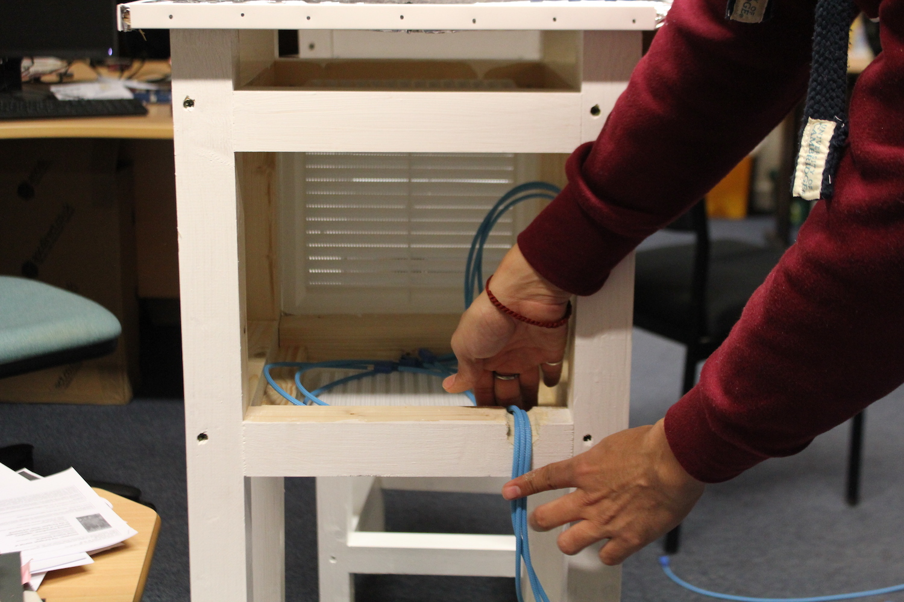 

### Using other parts

We give these instructions to build the exact Stevenson screen that we also used. Here are some suggestions if you are using different parts or can't access the same materials:

The size of the louvre vents dictate how much wood and parts you will need. You will need between 7 to 8 metres of wood depending on the size of the vents you use. The frame of the Stevenson screen is 1-metre tall and has 3 struts of wood: two that the louvre vent attaches to and one at the bottom for support. The width of these struts is determined by the maximum width of your louvre vent. The vent we used is 258 mm at its widest so this is the length of the struts that we cut. It is best to use vents that are square. If you cut the struts too small you will struggle to fit the louvre vent to the top and bottom of the Stevenson screen. To fix this you could file away some wood to fit the louvre vent in. If you cut the struts too long you will have to glue on some extra wood to fit the louvre vent. We found that we had to do this for the bottom and top of the screen because the louvre vents we used were not quite square.

The external screws secure all the pieces of wood together. The threaded shank should take up the majority of the screws' length. You want the screws to be around 50 percent longer than the thickest piece of timber. For us the thickest piece of wood was 44 mm so we used a screw that was 64 mm in length.

# Appendix 3: Additional Resources

### Air Quality Standards
   
* The EU Air Quality Objective is the current legislation for air quality in the UK. The limit value for PM 2.5 is 25 µg/m3 over a 1-year period. As this is an average over a longer period of time than you will be undertaking monitoring, you can also compare your readings to the World Health Organisation (WHO) guidance for PM 2.5, which is 25 µg/m3 for the 24-hour mean, and 10 µg/m3 for the annual mean (lower than the EU Air Quality Objective). 

More information on the EU Air Quality Objective is available at:
http://ec.europa.eu/environment/air/quality/standards.htm

* [Automatic Urban and Rural Network (AURN)](https://uk-air.defra.gov.uk/networks/network-info?view=aurn) - Data on UK’s largest automatic monitoring network.

* Greater London Authority (GLA), [Pollution and Air Quality.](https://www.london.gov.uk/WHAT-WE-DO/environment)

* [Local Authority Air Quality Management Tools (LAQM)](https://laqm.defra.gov.uk/) - Support for local authorities and practitioners of local air quality management.

* [London Air Quality Network (LAQN)](http://www.londonair.org.uk/LondonAir/Default.aspx) - London’s air quality is officially monitored through the London Air Quality Network (LAQN), a network of monitoring stations that is managed by King’s College London.

* [UK-AIR: Air Information Resource](https://uk-air.defra.gov.uk/) - A website created and hosted by AEA Energy & Environment on behalf of DEFRA and has a wide range of technical content on air quality. Note that air quality objectives are likely to change due to Brexit, and this site may include updated information.

### UK Air Quality Resources

* All-Party Parliamentary Group on Air Pollution, http://www.publications.parliament.uk/pa/cm/cmallparty/160603/air-pollution.htm and https://twitter.com/airpollAPPG

* Breathe London, https://www.breathelondon.org/

* Department for Environment, Food & Rural Affairs (DEFRA), Air quality statistics, https://www.gov.uk/government/statistics/air-quality-statistics

* Department for Environment, Food & Rural Affairs (DEFRA), Effects of Air Pollution, https://uk-air.defra.gov.uk/air-pollution/effects

* Department for Environment, Food & Rural Affairs (DEFRA), Interactive monitoring networks map, https://uk-air.defra.gov.uk/interactive-map

* Department for Environment, Food & Rural Affairs (DEFRA), UK-AIR: Air Information Resource, https://uk-air.defra.gov.uk

* Public Health England, Estimates of mortality in local authority areas associated with air pollution (10 April 2014), https://www.gov.uk/government/news/estimates-of-mortality-in-local-authority-areas-associated-with-air-pollution

* Public Health England, Particulate air pollution: health effects of exposure (12 March 2015), https://www.gov.uk/government/publications/particulate-air-pollution-health-effects-of-exposure

* Public Health England, Reports and statements from the Committee on the Medical Effects of Air Pollutants (COMEAP) (updated 9 January 2019), https://www.gov.uk/government/collections/comeap-reports

* Royal Colleges of Physicians and of Paediatrics and Child Health, Every breath we take: the lifelong impact of air pollution (23 February 2016), https://www.rcplondon.ac.uk/projects/outputs/every-breath-we-take-lifelong-impact-air-pollution

* UK Clean Air Act (1993, updated), http://www.legislation.gov.uk/ukpga/1993/11/contents

* UK Clean Air Act (1956), http://www.legislation.gov.uk/ukpga/Eliz2/4-5/52/enacted

### Global Air Quality Resources

* [EPA Air Sensor toolbox](https://www.epa.gov/air-sensor-toolbox) - US EPA guidelines for using air quality sensors.

* [EPA Air Sensors Educational Video Series](https://www.epa.gov/air-sensor-toolbox/videos-air-sensor-measurements-data-quality-and-interpretation) - Videos on Air Sensor Measurements, Data Quality, and Interpretation.

* World Health Organisation (WHO), Ambient (outdoor) air quality and health, https://www.who.int/news-room/fact-sheets/detail/ambient-(outdoor)-air-quality-and-health

* World Health Organisation (WHO) Guidelines for indoor air quality: household fuel combustion, https://www.who.int/airpollution/guidelines/household-fuel-combustion/en/

* World Health Organisation (WHO) Air quality guidelines – global update 2005, https://www.who.int/airpollution/publications/aqg2005/en/

### Citizen Groups Focusing on Air Quality in the UK 

* Clean Air Now, https://twitter.com/CleanAirNow_UK

* Clean Air SE23, https://www.facebook.com/groups/cleanairSE23/

* Ella Roberta Foundation, http://www.ellaroberta.org/

* Friends of the Earth, https://www.foe.co.uk

* Mapping for Change, http://mappingforchange.org.uk

* Mums for Lungs, https://www.mumsforlungs.org/

### Global Citizen Science Projects and Resources

* Addis Air, https://airquality.addisabeba.info/ : A community run air quality sensor network in Addis Abeba, Ethiopia.

* AirBox, https://pm25.lass-net.org/ : Air quality monitoring project in Taiwan.

* Breathe Mongolia—Clean Air Coalition, https://breathemongolia.org/about/ : A non-profit organisation of like-minded global citizens with different educational and professional backgrounds; working together to reduce the deadly air pollution in Mongolia 

* Breathe.Mosco, https://breathe.moscow/ : A project aimed at developing an international network of public air quality monitoring stations. 

* CanAir.io, http://canair.io/ : Citizen science initiative to create air quality network in Colombia.

* #CleanAirFL, https://floridadep.gov/comm/ombudsman-public-services/campaign/cleanairfl : Citizen science kits for air quality monitoring sponsored by governmental organization.

* Hawa Badlo - Act for a Better Tomorrow, http://changetheair.org/ : Hawa Badlo is an Indian grassroots movement fighting air pollution that has reached 6.6 million people digitally. 

* Healthy Air Coalition, http://www.healthyaircoalition.org/ : An initiative by activists and planners to monitor air quality in Bangalore, India.

* InfluenceAir, http://influencair.be/map-brussels/ : Citizen group monitoring air quality in Brussels, Belgium.

* Luftdaten, https://luftdaten.info/ : An initiative towards designing DIY air quality monitoring kits for air pollution monitoring.

* PakAirQuality, http://pakairquality.com/ : Pakistan Air Quality Initiative (PAQI پاکی) provides community-driven air quality data to increase social awareness.

* PurpleAir, https://www2.purpleair.com/ : An air quality monitoring network built on a new generation of "Internet of Things" sensors.

* Smart Citizen, https://smartcitizen.me/ : Initiative by FAB LAB Barcelona to monitor air quality by creating low-cost sensors called Smart Citizen Kits.

### Global Air Pollution Visualization Tools

* [IQ Air - Air Visual](https://www.airvisual.com/) - For visualizing air quality anywhere in the world.

* [World's Air Pollution](https://waqi.info/) - Real-time Air Quality Index.

### Air Quality Research Articles

* Chen, Ling-Jyh, Yao-Hua Ho, Hu-Cheng Lee, Hsuan-Cho Wu, Hao-Min Liu, Hsin-Hung Hsieh, Yu-Te Huang, and Shih-Chun Candice Lung. "An open framework for participatory PM2. 5 monitoring in smart cities." IEEE Access 5 (2017): 14441-14454.

* Chen, Ling-Jyh, Yao-Hua Ho, Hsin-Hung Hsieh, Shih-Ting Huang, Hu-Cheng Lee, and Sachit Mahajan. "ADF: An anomaly detection framework for large-scale PM2. 5 sensing systems." IEEE Internet of Things Journal 5, no. 2 (2017): 559-570.

* Dockery, Douglas W., C. Arden Pope, Xiping Xu, John D. Spengler, James H. Ware, Martha E. Fay, Benjamin G. Ferris Jr, and Frank E. Speizer. "An association between air pollution and mortality in six US cities." New England journal of medicine 329, no. 24 (1993): 1753-1759.

* Dutta, Prabal, Paul M. Aoki, Neil Kumar, Alan Mainwaring, Chris Myers, Wesley Willett, and Allison Woodruff. "Common sense: participatory urban sensing using a network of handheld air quality monitors." In Proceedings of the 7th ACM conference on embedded networked sensor systems, pp. 349-350. 2009.

* Eilenberg, S. Rose, R. Subramanian, Carl Malings, Aliaksei Hauryliuk, Albert A. Presto, and Allen L. Robinson. "Using a network of lower-cost monitors to identify the influence of modifiable factors driving spatial patterns in fine particulate matter concentrations in an urban environment." Journal of Exposure Science & Environmental Epidemiology (2020): 1-13.

* Gabrys, Jennifer. [How to Do Things with Sensors](https://manifold.umn.edu/projects/how-to-do-things-with-sensors). University of Minnesota Press, 2019.

* Gabrys, Jennifer, Helen Pritchard, and Benjamin Barratt. "[Just good enough data: Figuring data citizenships through air pollution sensing and data stories](https://journals.sagepub.com/doi/full/10.1177/2053951716679677)." Big Data & Society 3, no. 2 (2016): 2053951716679677.

* Gabrys, Jennifer. "[Planetary health in practice: sensing air pollution and transforming urban environments](https://www.nature.com/articles/s41599-020-00534-7)." Humanities and Social Sciences Communications 7, no. 1 (2020): 1-11.

* Mahajan, Sachit, and Prashant Kumar. "Evaluation of low-cost sensors for quantitative personal exposure monitoring." Sustainable Cities and Society (2020): 102076.

* Mallone, Sandra, Massimo Stafoggia, Annunziata Faustini, Gian Paolo Gobbi, Achille Marconi, and Francesco Forastiere. "Saharan dust and associations between particulate matter and daily mortality in Rome, Italy." Environmental health perspectives 119, no. 10 (2011): 1409-1414.

* Pantelic, Jovan, Megan Dawe, and Dusan Licina. "Use of IoT sensing and occupant surveys for determining the resilience of buildings to forest fire generated PM2. 5." PloS one 14, no. 10 (2019): e0223136.

* Piedrahita, Ricardo, Yun Xiang, Nick Masson, John Ortega, Ashley Collier, Yifei Jiang, Kun Li et al. "The next generation of low-cost personal air quality sensors for quantitative exposure monitoring." Atmospheric Measurement Techniques 7, no. 10 (2014): 3325.
 
* Reddy, K. Srikanth, and Janet Hatcher Roberts. "Mitigating air pollution: Planetary health awaits a cosmopolitan moment." The Lancet Planetary Health 3, no. 1 (2019): e2-e3.

* Simon, Stacy, and World Health Organization. "Outdoor air pollution causes cancer." World Health Organization (2013).

* Zheng, Tongshu, Michael H. Bergin, Karoline K. Johnson, Sachchida N. Tripathi, Shilpa Shirodkar, Matthew S. Landis, Ronak Sutaria, and David E. Carlson. "Field evaluation of low-cost particulate matter sensors in high-and low-concentration environments." Atmospheric Measurement Techniques 11, no. 8 (2018): 4823-4846.

* Zimmerman, Naomi, Albert A. Presto, Sriniwasa PN Kumar, Jason Gu, Aliaksei Hauryliuk, Ellis S. Robinson, Allen L. Robinson, and Ramachandran Subramanian. "A machine learning calibration model using random forests to improve sensor performance for lower-cost air quality monitoring." Atmospheric Measurement Techniques 11, no. 1 (2018): 291-313.

