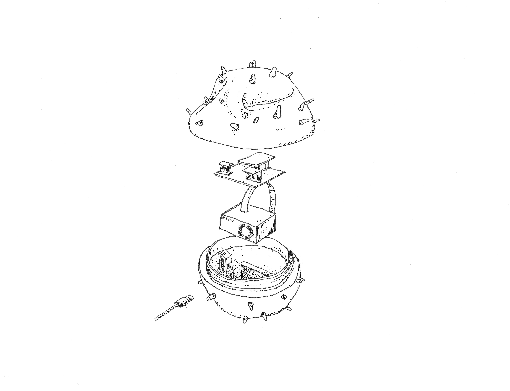

# AirKit Quick Start Guide

 

## Citizen Sense and the AirKit

Hello and thanks for contributing to [AirKit](https://citizensense.net/projects/airkit/) as part of the [Citizen Sense](https://citizensense.net/) research project. Citizen Sense investigates how people monitor their environments using digital technologies. We have created this AirKit toolkit based on our research into how people monitor air pollution. This pamphlet provides a quick set of instructions, along with health and safety guidance, so you can set up your Dustbox 2.0 monitor. More detailed instructions can be found in the full-length [Airkit Logbook](https://github.com/citizensense/AirKit_Logbook/blob/main/toolkit.md). 

The AirKit Logbook includes suggestions for how to set up an air-quality monitoring project, instructions on how to use and build a Dustbox 2.0 monitor for measuring particulate matter, guidance on analysing your data on our [Airsift](https://airsift.citizensense.net/) platform, and resources for writing your own data stories for communicating your data and proposals for action more widely. Our intention is to create an air quality monitoring toolkit that can be used by a broad range of community groups, concerned citizens, and environmental initiatives in order to observe, document and address the problem of air pollution.

Citizen Sense is led by [Prof Jennifer Gabrys](https://research.sociology.cam.ac.uk/profile/professor-jennifer-gabrys) in the Department of Sociology at the University of Cambridge. Our research has received funding from the European Research Council (ERC: 33147 and 77921). We welcome your comments and feedback to improve the toolkit. If you would like to get in touch, you can contact us at [info@citizensense.net](mailto:info@citizensense.net). 

## Setting up the Dustbox 2.0

The Dustbox 2.0 measures particulate matter 1, 2.5 and 10. We are especially interested in PM2.5, as research has indicated that this pollutant is particularly harmful to health. 

In order to set up and use the Dustbox 2.0 sensor you will need the following:
* Dustbox 2.0 monitor
* Wi-Fi network
*	Wi-Fi enabled device (i.e., mobile phone, tablet or computer)
*	Plug socket

The first time you turn on your Dustbox 2.0 you will need to connect it to a Wi-Fi network so that it can stream data to the [Airsift](https://airsift.citizensense.net/) platform. You do not need an app for this! Follow these steps to connect your Dustbox 2.0 to your Wi-Fi network:

1.	Plug in your Dustbox 2.0 to the power socket. Once it is powered it will start to flash. This indicates that the device is attempting to connect to a Wi-Fi network.
2.	When the device is not able to connect to a network, the speed of the flashing LED increases. This means that it is creating a local network.
3.	On your phone or laptop, navigate to the list of available Wi-Fi networks. Look for the network 'dustboxXXXX.' The XXXX will correspond to the number of your Dustbox. You will be provided with a unique password to connect your Dustbox 2.0 to your network.
4.	Connect to the local dustboxXXXX network by selecting it on your phone or laptop.
5.	After a few seconds, a webpage will open. You should select the option to ‘Configure Wi-Fi’ from this page. 
6.	Once you have selected, ‘Configure Wi-Fi,’ you will then need to click on the name of your Wi-Fi network (or SSID) that you wish to connect to from the list of available networks. This will autofill the SSID box below with the network name.
7.	Check that your network details are correct, type in your password and click connect. The connection can take a few minutes to establish. 
8.	Once a connection is established, the clear LED on the Dustbox 2.0 will change from flashing to continuous. Once the LED has stopped flashing, you can close the Wi-Fi configuration window on your phone or laptop. 
9.	Once data is sending, the LED will shut down. Your Dustbox 2.0 will now be sensing and sending data!
10.	The local ESP network will automatically disappear if you turn off the power to your Dustbox 2.0. Your Dustbox 2.0 will automatically re-connect to your Wi-Fi network once the Dustbox 2.0 is turned back on. 
11.	If you need to update your Wi-Fi connection because your Wi-Fi details change, you will need to re-configure your Dustbox 2.0 by repeating steps 1 to 7 above.
12.	The particulate matter, temperature and humidity data from your device will be sent to our database. You can view your data on Airsift on the [Dustboxes](https://airsift.citizensense.net/dustboxes/) page. Your data will be open for others to view, but it will not be identified by name. Instructions for using Airsift are available in [**Section 5**](https://github.com/citizensense/AirKit_Logbook/blob/main/toolkit.md#5-data-analysis-and-data-stories) of the AirKit Logbook. If you are unable to see your data, please refer to [**Appendix 1: Troubleshooting and FAQs**](https://github.com/citizensense/AirKit_Logbook/blob/main/toolkit.md#appendix-1-troubleshooting-and-faq). 
13.	You can assemble plots and graphs from the Airsift into your own [Data Stories](https://airsift.citizensense.net/datastories/). On the Citizen Sense website, you can also view examples of [Covid Data Stories](datastories-covid.citizensense.net/) that we have developed using the AirKit toolkit. 

## Health and Safety

The [AirKit toolkit](https://citizensense.net/kits/airkit/) should be relatively straightforward to use, and the Dustbox 2.0 should be easy to plug in and begin monitoring your air quality. However, it is important to follow common-sense precautions when setting up and using the Dustbox 2.0, and when monitoring air pollution more generally. Please follow this guidance when using your Dustbox 2.0:
*	If you have placed the Dustbox 2.0 in an area of expected elevated pollution activity, be sure to minimise prolonged exposure by spending only short periods of time near the monitoring area.
*	Make sure that the sensor is not mounted near any vents, cooking areas, humidifiers or boiler outlets as this could affect the sensor readings.
*	If you place the Dustbox 2.0 close to a roadside, take precautions and set the device back from the road to minimise risk from traffic. To minimise risk from road traffic, do not walk along the road while using monitoring kit or while looking at the website collecting data from the devices. 
*	When installing your Dustbox, be sure to secure any ground-level cables to minimise trip hazards. Regularly visually inspect the Dustbox 2.0 to ensure that it has not been damaged and there are no obvious defects.
*	Only plug the Dustbox 2.0 in or out when it is dry outdoors, and avoid exposure of the electronics to water.
*	In the event that dust or bugs get lodged in your sensors, you can power off the device, open the case at the centre and clean it by spraying the sensor opening with canned air. 
*	While you will need to open up the device for cleaning, you should avoid dismantling the electronics as this could present a risk of shock and could interfere with the measurement functioning of the device.
*	Ensure the Dustbox 2.0 is maintained and in a good state of repair when it is given to you.
*	Please note that if you borrow a Dustbox 2.0, you agree to take care of your kit and return it to us when requested. 
If you have any questions about how to maintain the Dustbox 2.0, please contact [info@citizensense.net](mailto:info@citizensense.net).
